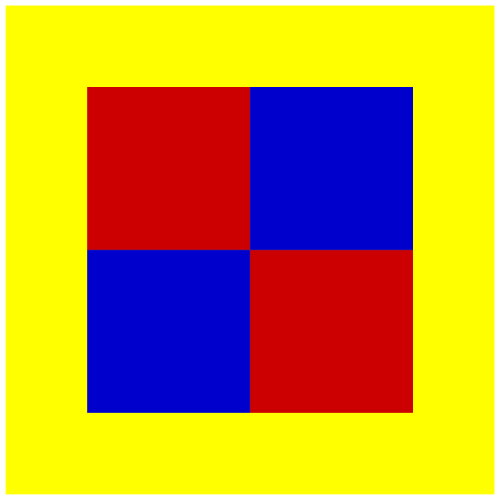

*********************
Documentation of code
*********************

Besides writing code and testing it, documenting the code is also an important
task which should not be neglected. In Python, it is a good habit to provide
each function or method with a docstring which might even contain doctests as we
have discussed in :numref:`doctests`. For more complex programs, modules or even
packages, it will not be sufficient to limit the documentation to the doctests.
This chapter will be devoted to the discussion of the documentation tool
*Sphinx* which is commonly employed to document Python project but which can 
be used also to document projects written in other programming languages. Even
the present lecture notes are making use of *Sphinx*.

*Sphinx* is based on the markup language *reStructuredText*. Due to its
unobtrusive syntax the original text can easily be read. At the same time,
the markup is powerful enough to produce nicely laid out output in different
formats, in particular in HTML and LaTeX. The latter can directly be used to
produce the documentation in PDF format.

The value of *Sphinx* for the documentation of software projects relies to a
large extent on its capability to make use of docstrings for inclusion in the
documentation. *Sphinx* thus provides another good reason to supply functions
and methods with docstrings.

In the following, we will first give an introduction to the markup language
*reStructuredText* and then explain some of the more important aspects of how
*Sphinx* can be used to document code. For further information, we refer to
the documentation of *reStructuredText* [#docreST]_ and *Sphinx* [#docSphinx]_.

Markup with reStructuredText
============================

Markup languages are used to annotate text for electronic text processing, for
example in order to specify its meaning. A text could be marked as representing
a section title and a computer program could then represent it accordingly, e.g.
as larger text set in boldface. A widespread markup language is the HyperText
Markup Language HTML used for markup of webpages. A pair of tags ``<LI>`` and
``</LI>`` would indicate in HTML that the enclosed text represents an item in
a list. An example of a markup language commonly found in a scientific context
is LaTeX. Here, ``x`` and ``$x$`` will be typset differently because the dollar
signs in the second case indicate that the character ``x`` is meant to be a
mathematical variable which usually is typeset in an italic font.

The markup in HTML and LaTeX helps computer programs to interpret the meaning
of the text and to represent it correctly. However, text written in these markup
languages often lacks a good human readability. This is particularly true for the
very flexible extensible markup language XML.

On the other hand, there exist so-called lightweight markup languages like
reStructuredText or Markdown where the latter may come in different variants.
These markup languages are designed in such a way that the meaning of the markup
appears rather natural to a human reader. From the following example written in
reStructuredText

.. code-block:: none

   Markup of lists
   ===============

   The following is a bullet-point list:

   * first item
   * second item

it is pretty clear that the first two lines represent a header title and the
last two lines represent a list. Due to the simplicity of its markup, Markdown
or one of its variants is commonly used in Wikis. Both, texts written in
Markdown or in reStructuredText are frequently used for documentation files in
software projects like README.md or README.rst, respectively, which usually
specify the purpose of the software and give further useful information. In
version control systems like Gitlab, they can be represented in a nice form
in the browser.

The documentation generator *Sphinx* is based on reStructuredText. Therefore, we
will now discuss some of the more important aspects of this markup language.

Within a text, parts can be emphasized or even strongly emphasized by enclosing
them in one or two stars, respectively. Inline literals are enclosed in a pairs
of back-quotes. It is important that these constructs should be delimited by 
characters which could also be used otherwise to delimit words like a whitespace
or a punctuation character. If a whitespace is used but should not appear in the
output, it needs to be escaped by means of a backslash. The text to which the
markup is applied may not start or end with a whitespace. The following example
provides an illustration. ::

   Text can be *emphasized*, usually as italics, or even **strongly emphasized**,
   usually as boldface. It is also possible of insert ``inline literals`` which
   will usually be represented as monospaced text.

   This is another paragraph showing how to embed an inline literal while
   suppressing the surrounding blanks: re\ ``structured``\ Text.

will be represented as [#sphinxLatexRepr]_

   Text can be *emphasized*, usually as italics, or even **strongly emphasized**,
   usually as boldface. It is also possible of insert ``inline literals`` which
   will usually be represented as monospaced text.

   This is another paragraph showing how to embed an inline literal while
   suppressing the surrounding blanks: re\ ``structured``\ Text.

This example also shows that paragraphs are separated by a blank line. On a
higher level, text is sectioned into parts, chapters, sections etc. A hierarchy
is established by adorning titles in a systematic way. To this end, an
underline or an underline together with an overline is added to the corresponding
title. An underline or overline is at least as long as the title and contains only
identical non-alphanumeric printable ASCII characters. It is recommended to choose
among the characters ``= - ` : . ' " ~ ^ _ * + #``. Note that even though in this way
one can define a large number of different sectioning levels, in practice this number
may be limited. For example, in HTML the number of different headings is limited to
six. An example of sectioning of a text could look as follows::

   ============
   Introduction
   ============

   A first section
   ===============

   Here comes some text ...

   A second section
   ================
   More text...

   A subsection
   ------------
   And so on...

As this example indicates, an empty line can be put after a title but this is not
mandatory.

Lists, either as bullet-point lists or as enumerated lists, can easily be obtained
in reStructuredText. In a bullet-point list, the items are indicated by a few characters
including ``* + - •``. If the text if an item runs over several lines, it needs
to be consistently indented. Sublists need to be separated from the surrounding list
by empty lines. The following example illustrates the use of bullet-point lists:

.. code-block:: none

   * This is the text for the first item which runs over several lines. Make
     sure that the text is consistently indented.

     Further paragraphs in an item can be added provided the indentation
     is consistent.
   * second item

     * a subitem

   * third item

This code results in

   * This is the text for the first item which runs over several lines. Make
     sure that the text is consistently indented.

     Further paragraphs in an item can be added provided the indentation
     is consistent.
   * second item

     * A subitem is obtained by indenting the corresponding entry.

   * third item

An enumerated list can be numbered explicitly by numbers, alphabet characters
in uppercase or lowercase, or Roman numerals. It is also possible to autonumber
a list by means of ``#``. The following example deliberately assigns the number
5 to the first item. In the following example, autonumbering is used. For the
last label, the number 2 is enforced. The following code

.. code-block:: none

   5. first item with automatic numbering
   #. second item

      #. subitem
      #. another subitem

   2. another item forced to be labelled by 2

results in

   5. first item with automatic numbering
   #. second item

      #. subitem
      #. another subitem

   2. another item forced to be labelled by 2

For scientific applications, one might want to include mathematical
expressions.  This can be done by means of the *math* role (``:math:``) for
inline mathematical expressions and the *math* directive (``math::``) for
displayed mathematical expressions. In both cases, the mathematical expression
is entered in LaTeX format. The following code

.. code-block:: none

   Einstein found the famous formula :math:`E=mc^2` which describes the
   equivalence of energy and mass.

   .. math::

      \int_{-\infty}^\infty \mathrm{d}x \mathrm{e}^{-x^2} = \sqrt{\pi}

will result in the output:

   Einstein found the famous formula :math:`E=mc^2` which describes the
   equivalence of energy and mass.

   .. math::

      \int_{-\infty}^\infty \mathrm{d}x \mathrm{e}^{-x^2} = \sqrt{\pi}

There exists also a directive to include images:

.. code-block:: none

   .. image:: img/example.png
      :width: 100
      :height: 100
      :align: center

The name of the image file to be included needs to be specified. Here, the file
happens to reside in a subdirectory ``img`` of the present directory. We have
also specified the size and the alignment of the figure, resulting in the
following output:

links, footnotes

.. [#docreSt] More information on reStructuredText can be found in the documentation
   of the docutils project at `<http://docutils.sourceforge.net/rst.html>`_.
.. [#docSphinx] The *Sphinx* project page can be found at `<https://www.sphinx-doc.org/>`_.
.. [#sphinxLatexRepr] Note that the representation given here and in following examples
       is generated by the LaTeX builder of *Sphinx*. It may look differently if the
       representation is generated otherwise.
