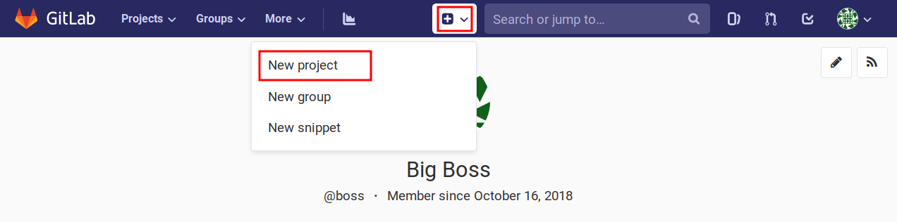
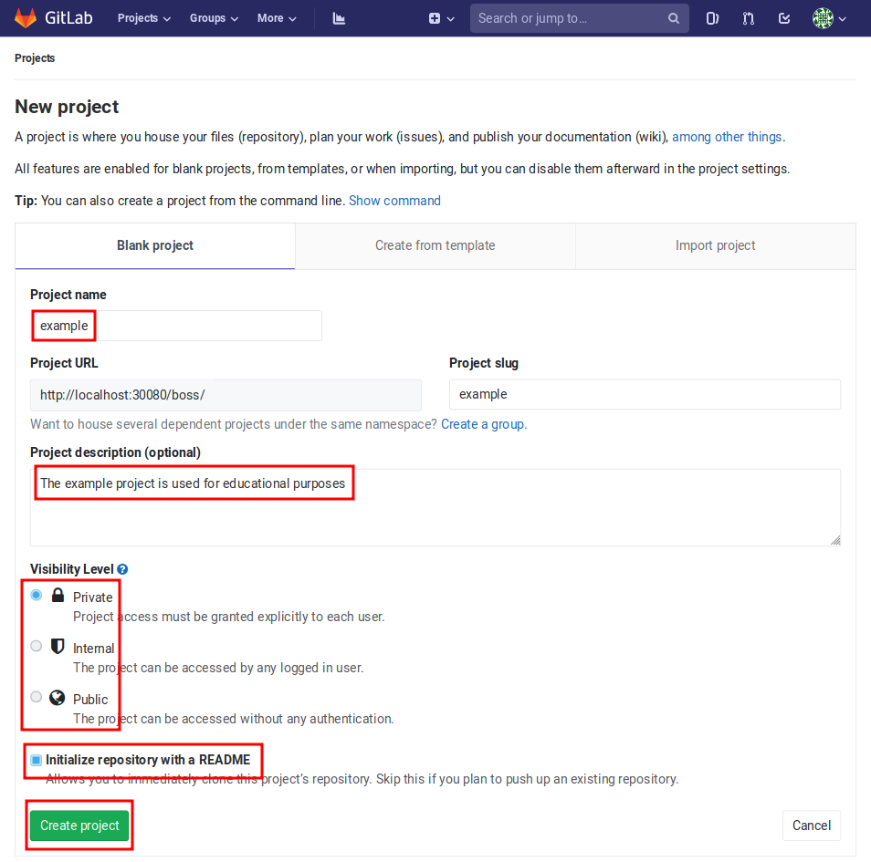
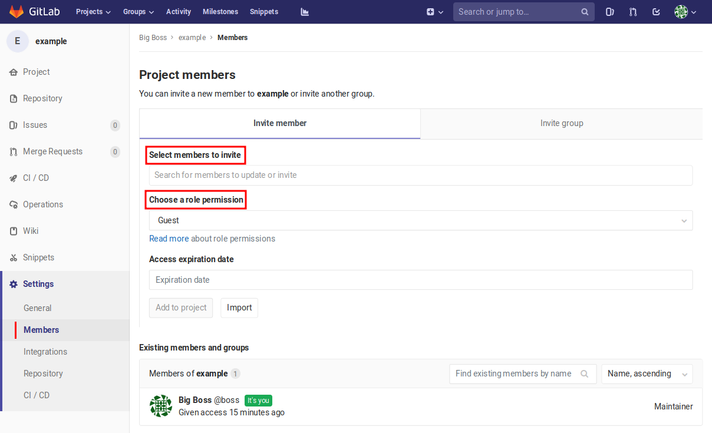
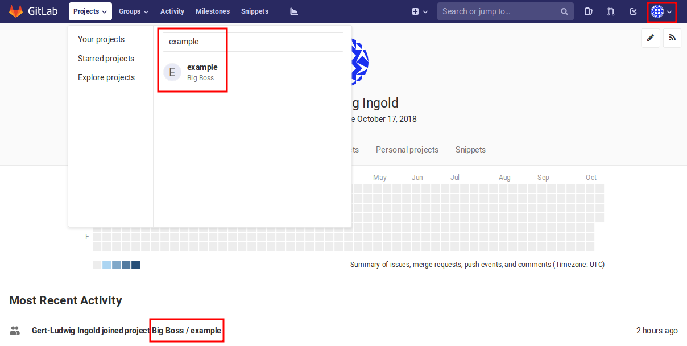
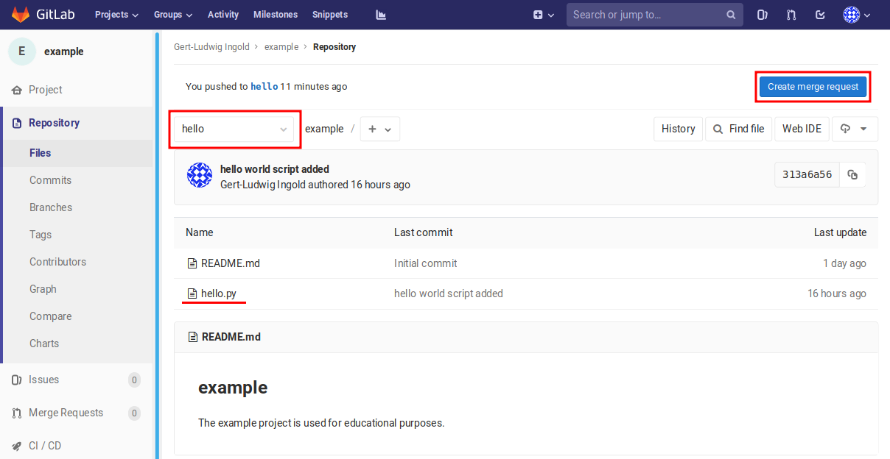
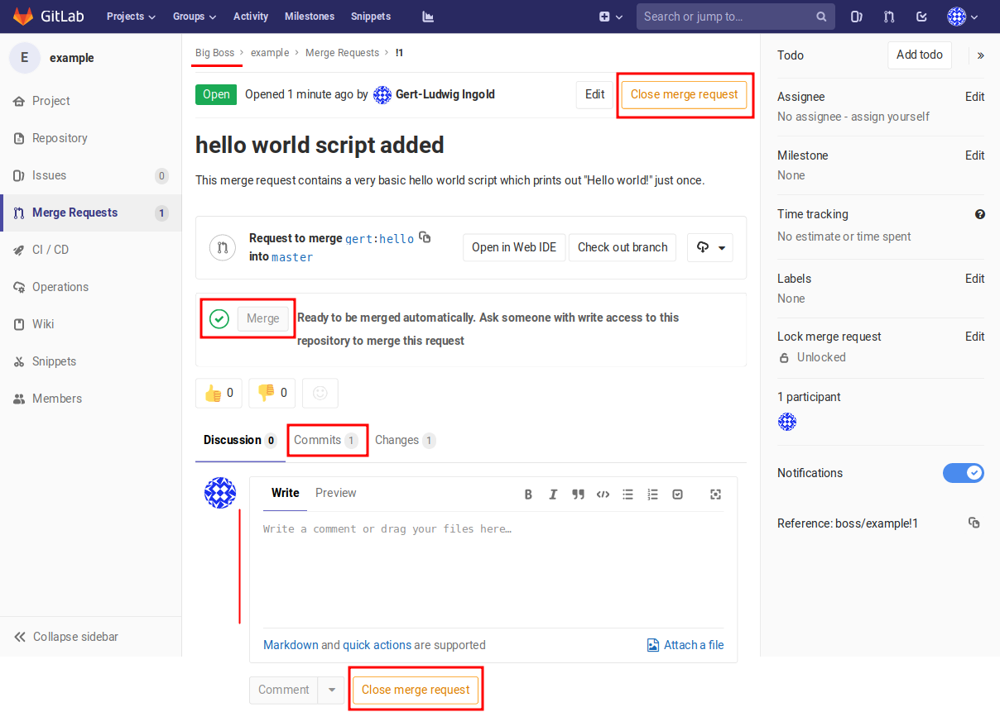

.. _version_control:

************************
Version Control with Git
************************

Why version control?
====================

A program is rarely written in one go but rather evolves through a number of
stages where the code is improved, for example by fixing errors or improving its
functionality. In this process, it is generally a good idea to keep old
versions. Occasionally, one has an apparently good idea of how to improve a
program, only to find out somewhat later that it was not such a good idea after
all. Without having the original version available, one might have a hard time
going back to it.

Often, old versions are kept in an informal way by inventing filenames to
distinguish different versions. Unless one strictly abides by a naming
convention, sooner or later one will be unable to identify the stage of 
development corresponding to a given file. Things become even more difficult if
more than one developer is involved.

The potential loss of a working program is not the only motivation to keep
a history of program versions. Suppose that a version of the program is used
to compute scientific data and suppose that the program is further developed,
e.g. by adding functionality. One might think that it is unnecessary to keep
the old version. However, imagine that at some point it turns out that the
program contains a mistake resulting in erroneous data. In such a situation,
it may become essential to know whether the data obtained previously are
affected by the mistake or not. Do the data have to be discarded or can continue
to use them? If the version of the code used obtain the data is documented, this
question can be decided. Otherwise, one probably could not trust the old data
anymore.

Another reason of keeping the history of a program is to document its evolution.
The motivation for design decisions can be made transparent and even bad
decisions could be kept for further reference. In a scenario where code is
developed by several or even a large number of people, it might be desirable to
know who is to be praised or blamed for a certain piece of code. Version control
systems often support collaborative development by providing tools to discuss
code before accepting the associated changes and by the possibility of easily
going back to an older version. In this way, trying out new ideas can be
encouraged.

A version control system storing the history of a software project is clearly
an invaluable tool. This insight is anything but new and indeed as early as in
the 1970s, a first version control system, SCCS (short for source code control
system), was developed. Later systems in wide use include RCS (revision control
system) and CVS  (concurrent versions system), both developed in the last century,
Subversion developed around the turn of the century and more recent systems
like Git, Mercurial and Bazaar.

Here, we will discuss the version control system Git created by Linus Torvalds
in 2005. Its original purpose was to serve in the development of the Linux
kernel. In order to make certain aspects of Git better understandable and to
highlight some of its advantages, we will consider in the following section
in some more detail different approaches to version control.

.. _cvcs-vs-dvcs:

Centralized and distributed version control systems
===================================================

Often software is developed by a team. For the sake of illustration let us
think of a number of authors working jointly on a text. In fact, scientific
manuscripts are often written in (La)TeX which can be viewed as a specialized
programming language. Obviously, there exists a probability that persons
working in parallel on the text will make incompatible changes. Inevitably, at
some point the question arises which version should actually be accepted. We
will encounter such situations later as so-called merge conflicts.

Early version control systems like RCS avoided such conflicts by a locking
technique. In order to change the text or code, it was necessary to first
lock the corresponding file, thus preventing other persons from modifying the
same file at the same time. Unfortunately, this technique tends to impede
parallel development. For our example of manuscript, it is perfectly fine
if several persons work in parallel on different sections. Therefore, locking
has been found not to be a good idea and it is not substitute for communication
between team members about who is doing what.

More modern version control systems are designed to favor collaboration within
a team. There exist two different approaches: centralized version control
systems on the one hand and distributed version control systems on the other
hand. The version control system Git which we are going to discuss in more
detail in this chapter is a distributed version control system. In order to
better understand some of its aspects, it is useful to contrast it with a
centralized version control system like Subversion.

.. _cvcs:
.. figure:: img/cvcs.*
   :width: 30em
   :align: center

   A centralized version control system contains a well defined set of
   files at any given moment in time which can be referred to by a
   sequential revision number.

More modern version control systems are designed to favor collaboration within
a team. There exist two different approaches: centralized version control
systems on the one hand and distributed version control systems on the other
hand. The version control system Git which we are going to discuss in more
detail in this chapter is a distributed version control system. In order to
better understand some of its aspects, it is useful to contrast it with a
centralized version control system like Subversion.

The basic structure of a centralized version control system is depicted in the
left part of :numref:`cvcs`. One or more developers, referred to as clients
here, exchange code versions via the internet with a central server. At any
moment of time, the server contains a definite set of files, i.e. a revision
which is numbered sequentially as indicated in the right part of :numref:`cvcs`.
From one revision to the next, files can change or remain unchanged and files
can be added or removed. The prize to pay for this simple sequential history 
is that an internet connection and a working server is needed in order to
create a new revision. A developer cannot create new revisions of the code
while working off-line, an important drawback of centralized version control
systems.

.. _dvcs:
.. figure:: img/dvcs.*
   :width: 30em
   :align: center

   In a distributed version control system each user keeps file versions in
   a local repository and exchanges versions with other repositories when
   needed. As a consequence no global sequential history can be defined.

As an alternative, one can use a distributed version control system which
is schematically represented in :numref:`dvcs`. In such a setup, each developer
keeps his or her own versions in a local repository and exchanges files
with other repositories when needed. Due to the local repository, one can
create a new version at any time, even in the absence of an internet connection.
On the other hand, there exist local version histories and the concept of
a global sequential revision numbering scheme does not make sense anymore.
Instead, Git uses hexadecimal hash values to identify versions of individual
files and sets of files, so-called commits, which reflect changes in the
code base. The main point to understand here is that the seemingly natural
sequential numbering scheme cannot work in a distributed version control
system. 

.. _dvcs-github:
.. figure:: img/dvcs-github.*
   :height: 10em
   :align: center

   A typical setup for the distributed version control system Git uses
   a central server to exchange versions between local repositories.

In most cases, a distributed version control system is not implemented
precisely in the way presented in :numref:`dvcs` as it would require
communication between potentially a large number of local repositories. A setup
like the one shown in :numref:`dvcs-github` is typical instead. The important
difference as compared to the centralized version control system displayed in
:numref:`cvcs` consists in the existence of local repositories where individual
developers can manage their code versions even if disconnected with the central
server. The difference is most obvious in the case of a single developer. Then,
a local repository is completely sufficient and there is no need to use another
server.

A central server for the use with the version control system Git can be set up
based on GitLab. Many institutions are running a GitLab instance
[#gitlab_uaux]_.  In addition, there exists the GitHub service at `github.com
<https://github.com/>`_. GitHub is popular among developers of open software
projects for which it provides repositories free of charge. Private
repositories can be obtained at a monthly rate, but there exists also the
possibility to apply for temporary free private repositories for academic use.
In later sections, when discussing collaborative code development with Git, we
will specifically address GitLab, but the differences to GitHub are usually
minor.

In the following sections, we will start by explaining the use of Git in a
single-user scenario with a local repository. This knowledge also forms the
basis for work in a multi-developer environment using GitLab or GitHub.

Getting help
============

Before starting to explore the version control system Git, it is useful to
know where one can get help. Generally, Git tries to be quite helpful even
on the command line by adding useful hints to its output. As the general structure
of a Git command starts with ``git <command>``, one can ask for help as follows::

   $ git help
   usage: git [--version] [--help] [-C <path>] [-c name=value]
              [--exec-path[=<path>]] [--html-path] [--man-path] [--info-path]
              [-p | --paginate | --no-pager] [--no-replace-objects] [--bare]
              [--git-dir=<path>] [--work-tree=<path>] [--namespace=<name>]
              <command> [<args>]
   
   These are common Git commands used in various situations:
   
   start a working area (see also: git help tutorial)
      clone      Clone a repository into a new directory
      init       Create an empty Git repository or reinitialize an existing one
   
   work on the current change (see also: git help everyday)
      add        Add file contents to the index
      mv         Move or rename a file, a directory, or a symlink
      reset      Reset current HEAD to the specified state
      rm         Remove files from the working tree and from the index
   
   examine the history and state (see also: git help revisions)
      bisect     Use binary search to find the commit that introduced a bug
      grep       Print lines matching a pattern
      log        Show commit logs
      show       Show various types of objects
      status     Show the working tree status
   
   grow, mark and tweak your common history
      branch     List, create, or delete branches
      checkout   Switch branches or restore working tree files
      commit     Record changes to the repository
      diff       Show changes between commits, commit and working tree, etc
      merge      Join two or more development histories together
      rebase     Reapply commits on top of another base tip
      tag        Create, list, delete or verify a tag object signed with GPG
   
   collaborate (see also: git help workflows)
      fetch      Download objects and refs from another repository
      pull       Fetch from and integrate with another repository or a local branch
      push       Update remote refs along with associated objects
   
   'git help -a' and 'git help -g' list available subcommands and some
   concept guides. See 'git help <command>' or 'git help <concept>'
   to read about a specific subcommand or concept.

Information on a specific command is obtained by means of ``git help <command>``.

Furthermore, Git provides a number of guides which can be read in a terminal window.
A list of available guides can easily be obtained::

   $ git help -g
   The common Git guides are:
   
      attributes   Defining attributes per path
      everyday     Everyday Git With 20 Commands Or So
      glossary     A Git glossary
      ignore       Specifies intentionally untracked files to ignore
      modules      Defining submodule properties
      revisions    Specifying revisions and ranges for Git
      tutorial     A tutorial introduction to Git (for version 1.5.1 or newer)
      workflows    An overview of recommended workflows with Git
   
   'git help -a' and 'git help -g' list available subcommands and some
   concept guides. See 'git help <command>' or 'git help <concept>'
   to read about a specific subcommand or concept.

For a detailed discussion of Git, the book *Pro Git* by Scott Chacon and Ben
Straub is highly recommended. Its second edition is available in printed form
`online <https://git-scm.com/book/en/v2>`_ where also a PDF version can be downloaded
freely. By the way, the book *Pro Git* as well as the present lecture notes have
been written under version control with Git.

Setting up a local repository
=============================

The use of a version control system is not limited to large software projects
but makes sense even for small individual projects. A prerequisite is the
installation of the Git software which is freely available for Windows, MacOS
and Unix systems from `git-scm.com <https://git-scm.com/>`_. This Git
installation can be used for all projects to be put under version control and
we assume in the following that Git is already installed on the computer. Even
though some graphical user interfaces exist, we will mostly discuss the use of
Git on the command line.

Putting a new project under version control with Git is easy. Once a directory
exists in which the code will be developed, one initializes the repository by
means of::

   $ git init

Note that the dollar sign represents the command line prompt and should not be
typed. Depending on your operating system setup, the dollar could be replaced by
some other character(s). Initializing a new repository in this way will create a
hidden subdirectory called ``.git`` in the directory where you executed the command.
The directory is hidden to avoid that it is accidentally deleted.

.. attention::

   Never delete the directory ``.git`` unless you really want to. You will
   loose the complete history of your project if you did not backup the project
   directory or synchronized your work with a GitLab server or GitHub. Removing
   the project directory will remove the subdirectory ``.git`` as well. 

The newly created directory contains a number of files and subdirectories::

   $ ls -a .git
   .  ..  branches  config  description  HEAD  hooks  info  objects  refs

Refrain from modifying anything here as you might mess up files and in this
way loose parts or all of your work.

After having initialized your project, you should let Git know about your name
and your email address by using the following commands::

   $ git config --global user.name <your name>
   $ git config --global user.email <your email>

where the part in angle brackets has to be replaced by the corresponding
information. Enclose the information, in particular your name, in double quotes
if it contains one or more blanks like in the following example::

   $ git config --global user.name "Gert-Ludwig Ingold"

This information will be used by Git when new or modified files are committed
to the repository in order to document who has made the contribution.

If you have globally defined your name and email address as we did here, you do
not need to repeat this step for each new repository. However, you can overwrite
the global configuration locally. This might be useful if you intend to use
a different email address for a specific project.

There are more aspects of Git which can be configured and which are documented
in `Section 8.1 of the Git documentation <https://git-scm.com/book/en/v2/Customizing-Git-Git-Configuration>`_. The presently active configuration can be inspected by means of::

   $ git config --list

For example, you might consider setting ``core.editor`` to your preferred editor.

Basic workflow
==============

.. _addcommit:
.. figure:: img/addcommit.*
   :height: 10em
   :align: center

   The transfer of a file to the repository is a two-step process. First one or
   more files are added to the staging area. In a second step, the files are
   committed to the repository.

A basic step in managing a project under version control is the transfer of one
or more new or modified files to the repository where all versions together
with metainformation about them is kept. What looks like a one-step process is
actually done in Git in two steps. For beginners, this two-step process often
gives rise to confusion. We therefore go through the process by means of an
example and make reference to :numref:`addcommit` where the two-step process is
illustrated. A convenient way to check the status of the project files is the
command ``git status``. When working with Git, you will use this command often
to make sure that everything works as expected or to remind yourself of the status
of the project files.

Suppose that we have just initialized our Git repository as explained in the 
previous section. Then, Git would report the following status::

   $ git status
   On branch master

   Initial commit

   nothing to commit (create/copy files and use "git add" to track)

The output first tells us that we are on a branch called ``master``. Later, we
will discuss the concept of branches and it will be useful to know this
possibility of finding out the current branch. For the moment, we can ignore
this line. Furthermore, Git informs us that we not committed anything yet so 
that the upcoming commit would be the initial one. However, since we have not
created any files, there is nothing to commit. As promised earlier, Git tries
to be helpful and adds some information about what we could do. Obviously, we
first have to create a file in the project directory.

So let us go ahead and create a very simple Python file:

.. code-block:: python

   print("Hello world!")

Now, the status reflects the fact that a new file ``hello.py``  exists::

   $ git status
   On branch master
   
   Initial commit
   
   Untracked files:
     (use "git add <file>..." to include in what will be committed)
   
           hello.py
   
   nothing added to commit but untracked files present (use "git add" to track)

Git has detected the presence of a new file but it is an untracked file which
will basically be ignored by Git. As we ultimately want to include our small
script ``hello.py`` into our repository, we follow the advice and add the
file. According to :numref:`addcommit` this corresponds to moving the file
to the so-called staging area, a prerequisite to ultimately committing the file
to the repository. Let us also check the status after adding the file::

   $ git add hello.py
   $ git status
   On branch master

   Initial commit

   Changes to be committed:
     (use "git rm --cached <file>..." to unstage)

           new file:   hello.py

Note that Git tells us how we could revert the step of adding a file in case of
need.  Having added a file to the staging area does not mean that this file has
vanished from our working directory. As you can easily check, it is still
there.

At this point it is worth emphasizing that we could collect several files in
the staging area. We could then transfer all files to the repository in one single
commit. Committing the file to the repository would be the next logical step.
However, for the sake of illustration, we want to first modify our script. Our
new script could read

.. code-block:: python

   for n in range(3):
       print("Hello world!")

The status now has changed to::

      $ git status
      On branch master
      
      Initial commit
      
      Changes to be committed:
        (use "git rm --cached <file>..." to unstage)
      
              new file:   hello.py
      
      Changes not staged for commit:
        (use "git add <file>..." to update what will be committed)
        (use "git checkout -- <file>..." to discard changes in working directory)
      
              modified:   hello.py

It reflects the fact that now there are two versions of our script ``hello.py``.
The section "Changes to be committed" lists the file or files in the staging area.
In our example, Git refers to the version which we added, i.e. the script consisting
of just a simple line. This version differs from the file present in our working
directory. This two-line script is listed in the section "Changes not staged for commit".
We could move it to the staging area right away or at a later point in case we want to commit
the two versions of the script separately. Note that the most recent version of the script
is no longer listed as untracked file because a previous version had been added and the
file is tracked now by Git.

Having a file in the staging are, we can now commit it by means of ``git commit``.
Doing so will open an editor allowing to define a commit message describing the 
purpose of the commit. The commit message should consist of a single line with
preferably at most 50 characters. If necessary, one can add an empty line followed
by a longer explanatory text. If a single-line commit message suffices, one can
give the message as a command line argument::

   $ git commit -m 'simple hello world script added'
   [master (root-commit) 39977af] simple hello world script added
    1 file changed, 1 insertion(+)
    create mode 100644 hello.py
   $ git status
   On branch master
   Changes not staged for commit:
     (use "git add <file>..." to update what will be committed)
     (use "git checkout -- <file>..." to discard changes in working directory)
 
           modified:   hello.py
 
   no changes added to commit (use "git add" and/or "git commit -a")

Checking the status, we see that our two-line script is still unstaged. We could
add it to the staging area and then commit it. Since Git already tracks this file,
we can carry out this procedure in one single step. However, this is only possible
if we do not wish to commit more than one file::

   $ git commit -a -m 'repetition of hello world implemented'
   [master 572e27b] repetition of hello world implemented
    1 file changed, 2 insertions(+), 1 deletion(-)
   $ git status
   On branch master
   nothing to commit, working tree clean

Now, we have committed two versions of our script as can easily be verified::

   $ git log
   commit 572e27bcb96441c19ee9dca948d0ac24f81eee79
   Author: Gert-Ludwig Ingold <gert.ingold@physik.uni-augsburg.de>
   Date:   Wed Sep 26 11:17:43 2018 +0200

       repetition of hello world implemented

   commit d4a783b4a9f91a02f1a4ae127c07e6f47f8281e6
   Author: Gert-Ludwig Ingold <gert.ingold@physik.uni-augsburg.de>
   Date:   Wed Sep 26 11:17:23 2018 +0200

       simple hello world script added

As we had discussed in :numref:`cvcs-vs-dvcs` the concept of distributed
version control systems does not allow for sequential revision numbers. Our two
commits can thus not be numbered as commit 1 and commit 2. Instead, commits in
Git are identified by their SHA-1 checksum [#sha1]_. The output above lists the
hashes consisting of 40 hexadecimal digits for the two commits. In practice,
when referring to a commit, it is often sufficient to restrict oneself to the
first 6 or 7 digits which typically characterize the commit in a unique way.
To obtain idea of how sensitive the SHA-1 hash is with respect to small changes,
consider the following examples::

   $ echo Python|sha1sum
   79c4e0b5abbd2f67a369ba6ee0b95438c38eb0cb  -
   $ echo python|sha1sum
   32886514c2621f81e01024aa84d0f829d2ce1fad  -

Now that we know how to commit one or more files, one can raise the question of
how often files should be committed. Generally, the rule is to commit often. A
good strategy is to combine changes in such a way that they form a logical
unit.  This approach is particularly helpful if one has to revert to a previous
version.  If a logical change affects several files, it is easy to revert this
change. If on the other hand, a big commit comprises many logically different
changes, one will have to sort out which changes to revert and which ones to
keep. Therefore, it makes sense to aim at so-called atomic commits where a
commit collects all file changes associated with a minimal logical change
[#add-p]_.  On the other hand, in the initial versions of program development,
it often does not make sense to do atomic commits. The situation may change
though as the development of the code progresses.

At the end of this section on the basic workflow, we point out one issue which
in a sense could already be addressed in the initial setting up of the repository,
but which can motivate only now. Having our previous versions safely stored in
the repository, we might be brave enough to refactor our script by defining a
function to repeatedly printing a given text. Doing so, we end up with two files

.. code-block:: python

   # hello.py
   from repeat import repeated_print

   repeated_print("Hello world!", 3)

and

.. code-block:: python

   # repeat.py
   def repeated_print(text, repetitions):
       for n in range(repetitions):
           print(text)

We verify that the scripts do what they are supposed to do ::

   $ python hello.py
   Hello world!
   Hello world!
   Hello world!

Everything works fine so that we add the two files to the staging area and
check the status before committing. ::

   $ git add hello.py
   $ git add repeat.py
   $ git status
   On branch master
   Changes to be committed:
     (use "git reset HEAD <file>..." to unstage)

           modified:   hello.py
           new file:   repeat.py

   Untracked files:
     (use "git add <file>..." to include in what will be committed)

           __pycache__/

Everything looks fine except for the fact that there is an untracked directory
``__pycache__``. This directory and its content are created during the import of
``repeat.py`` and should not go into the repository. After all, they are automatically
generated when needed. Here, it comes in handy to make use of a ``.gitignore`` file.
Each line in this file contains one entry which defines files to be ignored by Git.
For projects based on Python, Git proposes a ``.gitignore`` file starting with
the following lines::

   # Byte-compiled / optimized / DLL files
   __pycache__/
   *.py[cod]
   *$py.class

Lines starting with # are interpreted as comments. The second line excludes the
directory ``__pycache__`` as well as its content. The star in the last two
lines can replace any number of characters. The third line will exclude all
files ending with ``.pyc``, ``.pyo``, and ``.pyc``. For more details see ``git
help ignore`` and the `collection of gitignore files
<https://github.com/github/gitignore>`_, in particular ``Python.gitignore``.
The ``.gitignore`` file should be put under version control as it might develop
over time.

.. _git_branches:

Working with branches
=====================

In the previous section, the result of the command ``git status`` contained in
its first line the information ``On branch master``. The existence of one branch
strongly suggests that there could be more branches and this is actually the case.
So far, we have been working on the branch which Git had created for us during
initialization and which happens to be called ``master`` by default. As the use
of branches can be very useful, we will discuss them in the following.

In the previous section, we had created a Git repository and made a few commits.
Suppose that we have also committed the refactored version of our script as well
as the ``.gitignore`` file. The history of our repository then looks as follows::

   $ git log --oneline --graph --decorate --all
   * cf870a6 (HEAD -> master) .gitignore for Python added
   * c4b2a9e hello world script refactored
   * 572e27b repetition of hello world implemented
   * d4a783b simple hello world script added

Before discussing the output, let us briefly comment on the options used in the
``git log`` command. Usually, this command will be more verbose, giving the full
hash value of the commit, the name of the author and the date of the commit together
with the commit message. Using the switch ``--oneline``, this information can be
reduced to a single line. Its content could be configured but we do not need to
do this here. The options ``--graph`` and ``--all`` will have an effect once more
than one branch is present. Then, we will obtain a graphical representation of
the commit tree, i.e. the relation between the different branches. In addition,
we will be shown information about all branches, not only the branch we are on.
Finally, ``--decorate`` shows us references existing for certain commits. In our
case, the commit ``cf870a6`` is referred to as ``HEAD`` because that is the version
we are presently seeing in our working directory. This is also where the branch
``master`` is positioned right now. The usefulness of this information  will become
clear once we have more than one branch or when even working with remote branches.

The history documented by the output of ``git log`` is linear with the most
recent commit on top. As we have discussed earlier, Git is distributed version
control system. Therefore, we have to expect that other developers are doing
work in parallel which at some time should connect to our work. Otherwise, we
could simply ignore these developers. Consequently, in general we cannot expect
the history of our repository to be as simple as it is up to now.

However, we do not need other developers to have several lines of development
running in parallel for some time. Even for a single developer, it makes sense
to keep different lines of development separated at least for some time.
Suppose for the moment that you have a working program that is used to produce
data, the production version of the program. At the same time, you want to
develop this program further, e.g. in order to add functionality or to improve
its speed. Such a development should be carried out separately from the
production version so that the latter can easily be accessed in the repository
at any time. Or you have a potentially good idea which you would like to try
out, but you do not know whether this idea will make it into the main code.
Again, it is useful to keep the exploration of your idea separate from the
production version of your program. Of course, if the idea turns out to be a
good one, it should be possible to merge the new code into the production
version.

The solution to the needs occurring in these scenarios are branches. In a typical
scenario, one would keep the production version in the master branch which in
a sense forms the trunk of a tree. At a certain commit of the master branch,
a new branch will take that commit as a parent on which further development of,
e.g., a new aspect of the program is based. There could be different branches
extending from various commits and a branch can have further branches. The picture
of a tree thus seems quite appropriate. However, typically branches will not grow
forever in their own direction. Ideally, the result of the development in a branch
should ultimately flow back into the production code, a step referred to as
merging. 

Let us take a look at an example. As branches can be become a bit confusing once
you have several of them, it makes sense to make sure from time to time that you
are still on the right branch. We have not created a new branch and therefore are
on the master branch. This can be verified as follows::

   $ git branch
   * master

So far, we have only a single branch named ``master``. The star in front indicates
that we are indeed on that branch.

Now suppose that the idea came up not to greet the whole world but a single person
instead. This implies a major change of the program and there is a risk that the
program used in production might not always be working correctly if we do our work
on the master branch. It is definitely time to create a new branch. We call the
new branch ``dev`` for development but we could choose any other name. In general,
it is a good idea to choose telling names, in particular as the number of branches
grows.

The new branch can be created by means of ::

   $ git branch dev

We can verify the existence of the new branch::

   $ git branch
     dev
   * master

As the star indicates, we are still on the master branch, but a new branch named
``dev`` exists. Switching back and forth between different branches is done by means
of the ``checkout`` command. With the following commands, we got to the development
branch and back to the master branch while verifying where we are after each checkout::

   $ git checkout dev
   Switched to branch 'dev'
   $ git branch
   * dev
     master
   $ git checkout master
   Switched to branch 'master'
   $ git branch
     dev
   * master

In addition, we can check the history of our repository::

   $ git log --oneline --graph --decorate --all
   * cf870a6 (HEAD -> master, dev) .gitignore for Python added
   * c4b2a9e hello world script refactored
   * 572e27b repetition of hello world implemented
   * d4a783b simple hello world script added

Now, commit ``cf870a6`` is also part of the branch ``dev``. For the moment, the
new branch is not really visible as branch because we have not done any development.

Above, we have first created a new branch and then switched to the new branch. As one
typically wants to switch to the new branch immediately after having created it, there
exists a shortcut::

   $ git checkout -b dev
   Switched to a new branch 'dev'

The option ``-b`` demands a new branch to be created.

Everything is set up now to work on the new idea. Let us suppose that at some point
you arrive at the following script::

   # hello.py
   from repeat import repeated_print

   def hello(name="", repetitions=1):
       if name:
           s = "Hello, " + name
           repeated_print(s, repetitions)
       else:
           repeated_print("Hello world!", repetitions)

After committing it, the commit log looks as follows::

   $ git log --oneline --graph --decorate --all
   * c4e6c3a (HEAD -> dev) name as new argument implemented
   * cf870a6 (master) .gitignore for Python added
   * c4b2a9e hello world script refactored
   * 572e27b repetition of hello world implemented
   * d4a783b simple hello world script added
   
The history is still linear, but clearly the master branch and the development
branch are in different states now. The master branch is still at commit
``cf870a6`` while the development branch is at ``c4e6c3a``.  At this point, it
is worth going back to the master branch and to check the content of
``hello.py``. At first, it might appear that we have lost our recent work but
this is not the case because we had committed the new version in the development
branch. Switching back to ``dev``, we indeed find the new version of the
script.

During the development of the new script, we realized that it is a good idea
to define a default value for the number of repetitions and we decide that it
is a good idea to make a corresponding change in the master branch. Before
continuing to work in the development branch, we perform the following steps:

  1. check out the master branch ::

        $ git checkout master

  2. make modifications to ``repeat.py`` ::

        # repeat.py
        def repeated_print(text, repetitions=1):
            for n in range(repetitions):
                print(text)

  3. commit the new version of the script ::

        $ git commit -a -m 'default value for number of repetitions defined'

  4. check out the development branch ::

        $ git checkout dev

The commit history is no longer linear but has clearly separated into two branches::

   $ git log --oneline --graph --decorate --all
   * 36fdabf (master) default value for number of repetitions defined
   | * c4e6c3a (HEAD -> dev) name as new argument implemented
   |/  
   * cf870a6 .gitignore for Python added
   * c4b2a9e hello world script refactored
   * 572e27b repetition of hello world implemented
   * d4a783b simple hello world script added

Now it is time to complete the script ``hello.py`` by adding an exclamation mark
after the name and calling the new function ``hello``::

   # hello.py
   from repeat import repeated_print

   def hello(name="", repetitions=1):
       if name:
           s = "Hello, " + name + "!"
           repeated_print(s, repetitions)
       else:
           repeated_print("Hello world!", repetitions)

   if __name__ == "__main__":
       hello("Alice", 3)

Before committing the new version, we start thinking about atomic commits. Strictly
speaking, we made to different kinds of changes. We have added the exclamation mark
and added the function call. Instead of going back and making the changes one after
the other, we can recall that the option ``-p`` allows to choose which changes to
add to the staging area::

   $ git add -p hello.py
   diff --git a/hello.py b/hello.py
   index 9b21403..4577216 100644
   --- a/hello.py
   +++ b/hello.py
   @@ -2,7 +2,10 @@ from repeat import repeated_print
 
    def hello(name="", repetitions=1):
        if name:
   -        s = "Hello, " + name
   +        s = "Hello, " + name + "!"
            repeated_print(s, repetitions)
        else:
            repeated_print("Hello world!", repetitions)
   +
   +if __name__ == "__main__":
   +    hello("Alice", 3)
   Stage this hunk [y,n,q,a,d,/,s,e,?]?

Answering the question with ``s``, we are offered the possibility to add the
two changes separately to the changing area. In this way, we can create two
separate commits. After actually doing the commits, we arrive at the following
history::

   $ git log --oneline --graph --decorate --all
   * 69ae96f (HEAD -> dev) function call added
   * 8396a6b exclamation mark added
   * c4e6c3a name as new argument implemented
   | * 36fdabf (master) default value for number of repetitions defined
   |/  
   * cf870a6 .gitignore for Python added
   * c4b2a9e hello world script refactored
   * 572e27b repetition of hello world implemented
   * d4a783b simple hello world script added

Now, it is time to make the new functionality available for production, i.e. to
merge the commits from the development branch into the master branch. To this
end, we check out the master branch and merge the development branch::

   $ git checkout master
   Switched to branch 'master'
   $ git merge dev
   Merge made by the 'recursive' strategy.
    hello.py | 10 +++++++++-
    1 file changed, 9 insertions(+), 1 deletion(-)
   $ git log --oneline --graph --decorate --all
   *   d7ae102 (HEAD -> master) Merge branch 'dev'
   |\  
   | * 69ae96f (dev) function call added
   | * 8396a6b exclamation mark added
   | * c4e6c3a name as new argument implemented
   * | 36fdabf default value for number of repetitions defined
   |/  
   * cf870a6 .gitignore for Python added
   * c4b2a9e hello world script refactored
   * 572e27b repetition of hello world implemented
   * d4a783b simple hello world script added

In this case, Git has made a so-called three-way merge based on the common ancestor
of the two branched (``cf870a6``) and the current versions in the two branches
(``36fdabf``) and (``69ae96f``). It is interesting to compare the script ``repeat.py``
in these three versions. The version in the common ancestor was::

   # repeat.py cf870a6
   def repeated_print(text, repetitions):
       for n in range(repetitions):
           print(text)

In the master branch, we have ::

   # repeat.py 36fdabf
   def repeated_print(text, repetitions=1):
       for n in range(repetitions):
           print(text)

while in the development branch, the script reads ::

   # repeat.py 69ae96f
   def repeated_print(text, repetitions):
       for n in range(repetitions):
           print(text)

Note that in ``36fdabf`` a default value for the variable ``repetitions`` is
present while it is not in ``69ae96f``. The common ancestor serves to resolve
this discrepancy.  Obviously, a change was made in the master branch while it
was not done in the development branch. Therefore, the change is kept.  The
other modifications in the branches were not in contradiction, so that the
merge could be done automatically and produced the desired result.

The life of the development branch does not necessarily end here if we decide
to continue to work on it. In fact, the branch ``dev`` continues to exist until
we decide to delete it. Since all work done in the development branch is now
present in the master branch, we decide to delete the branch ``dev``::

   $ git branch -d dev
   Deleted branch dev (was 69ae96f).

An attempt to delete a branch which was not fully merged, will be rejected. This
could be the case if the idea developed in a branch turns out not to be a good
idea after all. The, deletion of the branch can be forced by replacing the option
``-d`` by ``-D``.

In general, one cannot expect a merge to run as smoothly as in our example. Frequently,
a so-called merge conflict arises. This is quite common if different developers work
in the same part of the code and their results are incompatible. For the sake of example,
let us assume that we add a doc string to the ``repeated_print`` function but choose
a different text in the master branch and in the development branch. In the master branch
we have ::

   # repeat.py in master
   def repeated_print(text, repetitions=1):
       """print text repeatedly
   
       """
       for n in range(repetitions):
           print(text)

while in the development branch we have chosen a different doc string ::

   # repeat.py in dev
   def repeated_print(text, repetitions):
       """print text several times"""
       for n in range(repetitions):
           print(text)

The commit history of which we only show the more recent part now becomes a bit
more complex::

   $ git log --oneline --graph --decorate --all -n8
   * 550d988 (HEAD -> dev) added a doc string
   | * f75d4bf (master) doc string added
   | *   d7ae102 Merge branch 'dev'
   | |\  
   | |/  
   |/|   
   * | 69ae96f function call added
   * | 8396a6b exclamation mark added
   * | c4e6c3a name as new argument implemented
   | * 36fdabf default value for number of repetitions defined
   |/  
   * cf870a6 .gitignore for Python added

We check out the master branch and try to merge once more the development branch::

   $ git checkout master
   Switched to branch 'master'
   11:45 $ git merge dev
   CONFLICT (content): Merge conflict in repeat.py
   Automatic merge failed; fix conflicts and then commit the result.

This time, the merge fails and Git informs us about a merge conflict. At this point,
Git needs to be told which version of the doc string should be used in the master
branch. Let us take a look at our script::

   # repeat.py
   <<<<<<< HEAD
   def repeated_print(text, repetitions=1):
       """print text repeatedly
   
       """
   =======
   def repeated_print(text, repetitions):
       """print text several times"""
   >>>>>>> dev
       for n in range(repetitions):
           print(text)

There are two blocks separated by ``=======``. The first block starting with
``<<<<<<< HEAD`` is the present version in the master branch where we are right
now. The second block terminated by ``>>>>>>> dev`` stems from the development
branch. The reason in the conflict lies in the different doc strings. In such a
situation, Git needs help. The script should now be brought into the desired
form by using an editor or a tool to handle merge conflicts. We choose ::

   # repeat.py
   def repeated_print(text, repetitions=1):
       """print text repeatedly
    
       """
       for n in range(repetitions):
           print(text)

but the other version or a version with further modifications would have been
possible as well. In order to tell Git that the version conflict has been
resolved, we add it to the staging area and commit it as usual. The history
now looks as follows::

   *   abcf4ed (HEAD -> master) merge conflict resolved
   |\  
   | * 550d988 (dev) added a doc string
   * | f75d4bf doc string added
   * |   d7ae102 Merge branch 'dev'
   |\ \  
   | |/  
   | * 69ae96f function call added
   | * 8396a6b exclamation mark added
   | * c4e6c3a name as new argument implemented
   * | 36fdabf default value for number of repetitions defined
   |/  
   * cf870a6 .gitignore for Python added

While the use of branches can be an extremely valuable technique even for a
single developer, branches will inevitable appear in a multi-developer environment.
A good understanding of branches will therefore be helpful in the following section.

Collaborative code development with GitLab
==========================================

So far, we have only worked within a single developer scenario and a local Git
repository was sufficient. However, scientific research is often carried out in
teams with several persons working on the same project at the same time. While
a distributed version control system like Git allows each person to work with
her or his local repository for some time, it will become necessary at some
point to share code. One way would be to grant all persons on the project
read access to all local repositories. However, in general such an approach
will result in a significant administrative load. It is much more common to
exchange code via a central server, typically a GitLab server run by an
institution or a service like `GitHub <https://github.com/>`_.

.. _gitlab:
.. figure:: img/gitlab.*
   :width: 30em
   :align: center

   Workflow for collaborative development in a distributed version control system
   with a GitLab instance as central server.

Independently of whether one uses a GitLab server or GitHub, the typical setup
looks like depicted in :numref:`gitlab` and consists of three repositories. In
order to understand this setup, we introduce to roles. The user is representative
of one of the individual developers while the maintainer controls the main project
repository. As a consequence of their respective roles, the user has read and
write access to her or his local repository while the maintainer has read and
write access to the main project repository, often referred to as ``upstream``.
Within a project team, every member should be able to access the common code
base and therefore should have read access to ``upstream``. In order to avoid that
the maintainer needs read access to the user's local repository, it is common
to create a third repository often called ``origin`` to which the user has read
and write access while the maintainer has read access. In order to facilitate
the rights management, ``origin`` and ``upstream`` are usually hosted on the same
central server. At same point in time, the user creates ``origin`` by a process
called forking, thereby creating her or his own copy of ``upstream``. This process
needs only to be done once. Afterwards, the code can flow in counter-clockwise
direction in :numref:`gitlab`. The individual steps are as follows:

1. The user can always get the code from the ``upstream`` repository, e.g. to
   use it as basis for the future development. There are two options, namely
   ``git pull`` and the two-step process ``git fetch`` and ``git merge`` which
   will discuss below.
2. Having read and write access both on the local repository and the ``origin``
   repository, the user can ``git push`` to move code to the central server.
   With ``git pull``, code can also be brought from the central server to a
   local repository. The latter is particularly useful if the user is working
   on several machines with individual local repositories.
3. As long as the user has no write access to ``upstream``, only the maintainer
   can transfer code from the user's ``origin`` to ``upstream``. Usually, the
   user will inform the maintainer by means of a merge request that code is being
   ready to be merged into the ``upstream`` repository [#merge_pull]_. After an
   optional discussion of the suitability of the code, the maintainer can merge
   the code into the ``upstream`` repository.

After these conceptual considerations, we discuss a more practical example. The
maintainer of the project will be called Big Boss with username ``boss`` and
she or he starts by creating a repository for a project named ``example``. We
will first go through the steps required to set up the project and then focus
on how one remotely interacts with this repository either as an owner of the
repository or a collaborator who contributes code via his or her repository.

.. _gitlab-create-project-1:

   Creation of a new project in a GitLab repository.

.. _gitlab-create-project-2:

   During the creation of a project its name and its visibility level need to
   be defined. In addition, it makes sense to add a project description and to
   initialize the repository with a README file.

After logging into a GitLab server, one finds in the dashboard on the top of
the screen the possibility to create a new project as shown in
:numref:`gitlab-create-project-1`. In order to actually create a new project,
some basic information is needed as shown in :numref:`gitlab-create-project-2`.
Mandatory are the name as well as the visibility level of the project. A
private project will only be visible to the owner and members who were invited
to join the project. Public projects, on the other hand, can be accessed
without any authentication. It is recommended to add a short description of the
project so that its purpose becomes apparent to visitors of the project page.
In addition, it is useful to add at least a short README file. This README file
initially will contain the name of the repository and the project description.
It can be extended over time by adding information useful for visitors of the
project page. Creating a README file also ensures that the repository contains
at least one file.

.. tip:: 

   Markup can be used to format the README page. Markup features include
   headers, lists, web links and more. GitLab and GitHub recognize markdown
   (file extension ``.md``) and  restructured text (file extension ``.rst``).
   We recommend to take a look at the `Markdown Style Guide of GitLab
   <https://about.gitlab.com/handbook/product/technical-writing/markdown-guide/>`_
   and to experiment with different formatting possibilities. This is also a
   good opportunity to exercise your version control skills. You can check the
   effect of the markup by taking a look at the project page.

.. _gitlab-create-project-3:
.. figure:: img/gitlab-create-project-3.png
   :width: 30em
   :align: center

   The new repository can be accessed via the HTTP and SSH protocols. Users with
   access to the repository can also fork it.

The project page shown in :numref:`gitlab-create-project-3` contains relevant
elements for users collaborating on the project. There is the possibility to
create a fork of the project. According to the workflow represented in
:numref:`gitlab`, forking a project creates a new repository usually referred
to as ``origin`` which is based on the repository referred to as ``upstream``.
The key point in forking is to create a repository to which the user has write
access, which need not be the case for the original project.

Furthermore, the screen depicted in :numref:`gitlab-create-project-3` contains
information about the URL under which the repository can be accessed. We will
need this information later on. As the figure shows, the repository can be
accessed via the HTTP protocol which will ask for the username and password, if
necessary. An alternative is the SSH protocol which requires that a public SSH
key of the user is stored on the GitLab server. Finally,
:numref:`gitlab-create-project-3` demonstrates how the information entered when
setting up the project is used to create a minimal README file which is displayed
in a formatted way at the bottom of the project page.

.. tip::

   Information on how to create a SSH key can be found for example in the
   section `GitLab and SSH keys <https://docs.gitlab.com/ee/ssh/>`_ of the
   GitLab documentation.

.. _gitlab-create-project-4:

   On the setting page, other users can be invited to join the project and their
   permissions can be defined.

.. _gitlab-create-project-5:
.. figure:: img/gitlab-create-project-5.png
   :width: 30em
   :align: center

   A new team member has been added to the project as developer.

The previous discussion had already the idea of collaborative work on the
project in mind. However, for the moment nobody has access to the project
except the owner who had created the project. Additional team members can be
invited in the settings menu by accessing the members page shown in
:numref:`gitlab-create-project-4`. Here, team members can be invited and their
permissions can be defined. If a new team member should be able to contribute
code to the project, he or she while typically take on the role of a developer.
:numref:`gitlab-create-project-5` shows that a new team member has been successfully
added in the role of a developer. The project maintainer can remove team members
at any time by clicking on the red icon on the right.

We are now in a position to explore the collaborative workflow shown in
:numref:`gitlab`. There exists an alternative approach relying on protected branches
which we do not cover here [#protected_branches]_. 

For the following discussion, we assume that user ``boss`` has created a
project called ``example`` which can be accessed as indicated in
:numref:`gitlab-create-project-3`.  In our case, the HTTP access would be via
the address ``http://localhost:30080/boss/example.git`` and for SSH access we
would use ``ssh://git@localhost:30080/boss/example.git``. In a real
application, be sure to replace these addresses by the addresses indicated on
the project page. Maintainer ``boss`` has invited developer ``gert`` to the
project team and the latter now has to set up his system to be able to
contribute to project ``example``. During the discussion, it might be useful to
occasionally take a look at :numref:`gitlab` in order to connect the details to
the overall picture.

.. _gitlab-developer-1:

   In order to navigate to a repository, one can for example search for it or
   use a direct link if one has joined the project recently. This page can be
   accessed by choosing "Profile" from the avatar menu in the upper right
   corner.

In a first step, user ``gert`` logs into the GitLab server and goes to the
project ``example`` of user ``boss``. A possibility to do so consists in
searching for the project name in the dashboard as shown in
:numref:`gitlab-developer-1`. On the user's profile page, there might be
alternative ways like in :numref:`gitlab-developer-1` where the repository is
listed because the user joined it recently. At a later stage, it would also be
possible to go via the forked repository or the list of contributed projects.
In any case, the user ``gert`` will see a page looking almost like the one
displayed in :numref:`gitlab-create-project-3`. In particular, there will be a
fork button which initiates the creation of a fork of the original project as
a project of user ``gert``. In the notation of :numref:`gitlab`, a repository
``origin`` has been created as a copy of the present state of the repository
``upstream``.

According to :numref:`gitlab`, the developer now needs to create a local
repository for the project based on his or her own repository on the GitLab
server, i.e. the repository referred to as ``origin``. Using the URL shown
in :numref:`gitlab-create-project-3`, the repository is cloned into a local
directory as follows::

   $ git clone ssh://git@localhost:30022/gert/example.git
   Cloning into 'example' ...
   remote: Enumerating objects: 3, done.
   remote: Counting objects: 100% (3/3), done.
   remote: Compressing objects: 100% (2/2), done.
   remote: Total 3 (delta 0), reused 3 (delta 0)
   Receiving objects: 100% (3/3), done.
   $ ls -a example
   .  ..  .git  README.md

In the third line, the passphrase for the SSH key needs to be given. If the
HTTP protocol were used, username and password would have been requested. In
the last line we see that the directory `.git` has been created without the
need of initializing the repository. By default, `git clone` transfers the
repository with its complete history, unless only part of the history is
requested by means of the ``--depth`` argument.

In contrast to the previous sections, we are no longer only working with a 
local repository but also with the two remote repositories ``origin`` and
``upstream`` on the GitLab server. To find out which remote repositories are
locally known, we go to the directory where the repository is located and use::

   $ git remote -v
   origin  ssh://git@localhost:30022/gert/example.git (fetch)
   origin  ssh://git@localhost:30022/gert/example.git (push)

These lines tell us that the developer's repository ``example`` on the remote
server is available for read and write under the name ``origin``. However, we
also need access to the repository usually referred to as ``upstream``. This
can be achieved by telling Git about this remote repository::

   $ git remote add upstream ssh://git@localhost:30022/boss/example.git
   $ git remote -v
   origin  ssh://git@localhost:30022/gert/example.git (fetch)
   origin  ssh://git@localhost:30022/gert/example.git (push)
   upstream        ssh://git@localhost:30022/boss/example.git (fetch)
   upstream        ssh://git@localhost:30022/boss/example.git (push)

Now we can refer to the original remote repository as ``upstream``. The existence
of a channel for pushing does not necessarily imply that we have the permission
to actually write to ``upstream``.

Being a developer on the ``example`` project, we want to contribute code to the
project. Already in our discussion of the workflow within a purely local
repository we have seen that it might be useful to do development work in
dedicated branches. The same is true in a setup involving remote repositories.
In the discussion of merge requests we will give an additional argument in
favor of using dedicated branches for different aspects of development. While
various approaches to the use of branches are possible, a judicious choice
would be to attribute a special role to the master branch by keeping it in sync
with the ``upstream`` repository. By branching off from the ``master`` repository,
the development activities can be kept close to the code on ``upstream``, thereby
facilitating a later merge into the main code base.

The developer decides to contribute a "Hello world" script to the ``example`` project
and first creates a new branch named ``hello``::

    $ git checkout -b hello
    Switched to a new branch 'hello'
    $ git branch
    * hello
      master

We already now how to commit a script to the new branch. After doing so, the content
of the main directory is::

   $ ls -a
   .  ..  .git  hello.py  README.md

and the history reads::

   $ git log --oneline --decorate
   * 313a6a5 (HEAD -> hello) hello world script added
   * 7219a23 (origin/master, origin/HEAD, master) Initial commit

The local branch ``master`` as well as the remote branch ``origin/master`` are still
at the initial commit ``7219a23`` while the local branch ``hello`` is one commit
ahead. The remote repository ``origin`` is not aware of the new branch yet. Furthermore,
the local repository has not yet any information about the remote repository ``upstream``.

In a next step, the developer pushes the new commit or several of them to the
remote repository ``origin`` where he or she has write permission::

   $ git push -u origin hello
   Counting objects: 3, done.
   Delta compression using up to 4 threads.
   Compressing objects: 100% (2/2), done.
   Writing objects: 100% (3/3), 328 bytes | 328.00 KiB/s, done.
   Total 3 (delta 0), reused 0 (delta 0)
   remote:
   remote: To create a merge request for hello, visit:
   remote:   http://localhost:30080/gert/example/merge_requests/new?merge_request%5Bsource_branch%5D=hello
   remote:
   To ssh://localhost:30022/gert/example.git
    * [new branch]      hello -> hello
   Branch 'hello' set up to track remote branch 'hello' from 'origin'.

.. _gitlab-developer-2:

   The script ``hello.py`` has been successfully pushed to the remote branch
   ``origin/hello``. It can now be brought to the remote repository ``upstream``
   by means of a merge request.

Actually, two things have happened here at the same time. The commit ``313a6a5`` was
pushed to the branch ``hello`` on ``origin``. Because of the option ``-u``, the local
branch was associated with the remote branch. From now on, if one wants to push
commits from the local branch ``hello`` to the corresponding remote branch, it suffices
to use ``git push``. This is not only shorter to type but also avoids to accidentally
push commits to the wrong branch. We can verify that the commit is now present on the
remote server either by means of::

   $ git log --oneline --decorate
   313a6a5 (HEAD -> hello, origin/hello) hello world script added
   7219a23 (origin/master, origin/HEAD, master) Initial commit

where commit ``313a6a5`` now also refers to ``origin/hello``. Alternatively,
one can take a look at the project page on the GitLab server which will look
like :numref:`gitlab-developer-2`. Make sure that the branch has been changed
from ``master`` to ``hello`` because that is where the script has been pushed
to. It is not and should not be present in ``origin/master`` at this point.

Following the workflow displayed in :numref:`gitlab`, the developer might now want
to contribute the new script to the ``upstream`` repository. If the developer has
no write access to this repository, he or she can make a merge request as we will
explain now. If, on the other hand, the developer has write access to the ``upstream``
repository, he or she could push the script directly there. However, even with
with write access it might be preferable to contribute code via a merge request
and this could be the general policy applying even to maintainers. The advantage
of merge requests is that other team members can automatically be informed about
new contributions and have a chance to discuss them before they become part of
the ``upstream`` repository. As long as the person merging the submitted code
is different from the submitter, a second pair of eyes can take a look at the
code and spot potential problems. In the end, the project team or the team leaders
have to decide which policy to follow.

.. _gitlab-developer-3:
.. figure:: img/gitlab-developer-3.png
   :width: 30em
   :align: center

   GitLab page for the preparation of a new merge request.

On the project page shown in :numref:`gitlab-developer-2`, there is a button in the
upper right with the title "Create merge request" which does precisely what this
title says. Clicking this button will bring up a page like the one depicted in
:numref:`gitlab-developer-3`. It is important to give a descriptive title as it
will appear in a list of potentially many merge requests. In addition, the purpose
of the merge request as well as additional relevant information like design
considerations should be stated in the description field. Optionally, labels can
be attributed to the merge request or merge requests can be assigned to milestones.
As these possibilities are mostly of interest in larger projects, we will not
discuss them any further here.

At this point, it is appropriate to give the use of branches a bit more consideration.
Suppose that the merge request is not merged into ``upstream`` right away and
that the developer is continuing development. After some time, he or she will
commit the new work to the ``hello`` branch on ``origin``. Then this new commit
will automatically be part of the present merge request even though the new
commit might not be logically related to the merge request. In such a situation,
it is better to start a new branch, probably based on the local ``master`` branch.

.. _gitlab-developer-4:

   A merge request can be discussed. It can be merged and closed or even closed
   without merging if the code has been found to be unsuitable for the project.
   The page shown here assumes that the user logged in has write permission for
   the project.

Even though the merge request is based on code in the repository ``origin``, it
will appear in the list of merge requests for the repository ``upstream`` because
that is where the code should be merged. The page of an open merge request looks
similar to :numref:`gitlab-developer-4`. It offers the possibility to view the
commits included in the merge request and to comment on them. Persons with write
permission on ``upstream`` have the possibility to merge the commits contained
in the merge request and to close it afterwards. If the code should not be
included in ``upstream``, the merge request can also be closed without merging.
In this case, reasons should of course be given in the discussion section.
Let us assume that the maintainer merges the commits in the merge request without
further discussion and closes the merge request.

The developer's code has successfully found its way to the ``upstream`` repository.
However, his or her local repository does not yet reflect this change. It is now
time to complete the circle depicted in :numref:`gitlab` and to get the changes
from the ``upstream`` repository into the local repository. We will assume that
we organise our branches in such a way that the local ``master`` branch should be
kept in sync with the ``master`` branch in the ``upstream`` repository. If we
are still in the development branch ``hello``, it is now time to go back to the
``master`` branch::

   $ git checkout master
   Switched to branch 'master'
   Your branch is up-to-date with 'origin/master'.

Now, we have two options. With ``git pull upstream master``, the present state
of the remote branch ``master`` on ``upstream`` would be downloaded and merged
into the present local branch. For a better control of the process, one can split
it into two steps::
   
   $ git fetch upstream
   remote: Enumerating objects: 1, done.
   remote: Counting objects: 100% (1/1), done.
   remote: Total 1 (delta 0), reused 0 (delta 0)
   Unpacking objects: 100% (1/1), done.
    * [new branch]    master     -> upstream/master
   $ git merge upstream/master
   Updating 7219a23..e55831a
   Fast-forward
    hello.py | 1 +
    1 file changed, 1 insertion(+)
    create mode 100644 hello.py

``git fetch`` gets new objects from the ``master`` branch and ``git merge upstream/master``
merges the objects from the remote branch ``upstream/master``. The history of the
local ``master`` repository looks as follows::

   $ git log --oneline --graph --decorate --all
   *   e55831a (HEAD -> master, upstream/master) Merge branch 'hello' into 'master'
   |\
   | * 313a6a5 (origin/hello, hello) hello world script added
   |/
   * 7219a23 (origin/master, origin/HEAD) Initial commit

As we can see, the local ``master`` branch and the remote ``master`` branch on the ``upstream``
repository are in sync while the ``master`` branch on the ``origin`` repository is still
in its original state. This makes sense because the hello world script was pushed to
the ``hello`` repository on the ``origin`` repository, but not its ``master`` branch.
We can change this by pushing the local ``master`` branch to ``origin``.

Before doing so, let us remove the ``hello`` branch which we do not need anymore::

   $ git push origin --delete hello
   To ssh://localhost:30022/gert/example.git
    - [deleted]         hello
   $ git branch -d hello
   Deleted branch hello (war 313a6a5).   

.. _gitlab-developer-5:
.. figure:: img/gitlab-developer-5.png
   :width: 30em
   :align: center

   At the tab "Settings - Branches" individual branches or all merged branches can
   be removed.

The first command deleted the remote branch. As an alternative way, one can use
the GitLab web interface as shown in :numref:`gitlab-developer-5`. There
individual branches or all merged branches can be removed. However, the local
references to the remote branches are not yet deleted. If one wants to remove
references to branches on ``origin`` which do no longer exist, one can use
``git remote prune origin``. The second command above deletes the local
branch, provided that no unmerged commits are still present. One can force
deletion of the branch with the option ``-D`` but may risk the loss of data.
Using ``-D`` instead of ``-d`` should thus be done with care.

After pushing the local ``master`` branch to ``origin``, the log looks as follows::

   $ git push origin master
   Counting objects: 1, done.
   Writing objects: 100% (1/1), 281 bytes | 281.00 KiB/s, done.
   Total 1 (delta 0), reused 0 (delta 0)
   To ssh://localhost:30022/gert/example.git
      7219a23..e55831a  master -> master
   $ git log --oneline --decorate --graph
   *   e55831a (HEAD -> master, upstream/master, origin/master, origin/HEAD) Merge branch 'hello' into 'master'
   |\
   | * 313a6a5 hello world script added
   |/
   * 7219a23 Initial commit

All three ``master`` branches are now in the same state and we have completed a basic
development cycle.

Sundry topics
=============

Stashing
--------

In the previous sections, we have only discussed the basic workflows with Git
and certainly did not even attempt to be complete. In the day-to-day work with
a Git repository, certain problems occasionally arise. Some of them will be
discussed in this section.

For the first scenario, let us assume that we have created a ``dev`` branch
where we modified the ``hello.py`` script and committed the new version. We
can then change between branches without any problem::

   $ git checkout -b dev
   Switched to a new branch 'dev'
   $ cat hello.py
   print("Hello world!")
   print("Hello world!")
   print("Hello world!")
   $ git commit -a -m'repetitive output of message'
   [dev 01dc5a1] repetitive output of message
    1 file changed, 2 insertions(+)
   $ git checkout master
   Switched to branch 'master'
   Your branch is up-to-date with 'origin/master'.
   $ git checkout dev
   Switched to branch 'dev'

The situation is different if we do not commit the changes. In the following
example, we have implemented the repetitive output by means of a for loop
but did not commit the change. Git now does not allow us to change to the
``master`` branch because we might lose data::

   $ cat hello.py
   for _ in range(3):
       print("Hello world!")
   $ git checkout master
   error: Your local changes to the following files would be overwritten by checkout:
           hello.py
   Please commit your changes or stash them before you switch branches.
   Aborting

We could force Git to change branches by means of the option ``-f`` but probably
it is a better idea to follow Git's advice and commit or stash the changes. We
know about committing but what does stashing mean? The idea is to pack away the
uncommitted changes so that they can be retrieved when we return to the ``dev``
branch::

   $ git stash
   Saved working directory and index state WIP on dev: 01dc5a1 repetitive output of message
   $ git checkout master
   Switched to branch 'master'
   Your branch is up-to-date with 'origin/master'.
   $ git checkout dev
   Switched to branch 'dev'
   $ cat hello.py
   print("Hello world!")
   print("Hello world!")
   print("Hello world!")

After stashing the changes, Git allowed us to switch back and forth between the
``master`` and ``dev`` branch. However, after returning to the ``dev`` branch
it looks as if the script with the for loop were lost. Fortunately, this is not
the case as becomes clear from listing the content of the stash. One can retrieve
the modified script by popping it from the stash::

   $ git stash list
   stash@{0}: WIP on dev: 01dc5a1 repetitive output of message
   $ git stash pop
   On branch dev
   Changes not staged for commit:
     (use "git add <file>..." to update what will be committed)
     (use "git checkout -- <file>..." to discard changes in working directory)

           modified:       hello.py

   no changes added to commit (use "git add" and/or "git commit -a")
   Dropped refs/stash@{0} (049ca57b4dda40d0869129482e2d216f82186d75)
   $ cat hello.py
   for _ in range(3):
       print("Hello world!")

As the code example given above demonstrates, one can list the content of the
stash. However, after some time it is easy to forget that one has stashed code
in the first place. Therefore, stashing is most suited for brief interruptions
where one needs to change branches for a short period of time. Otherwise,
committing the changes might be a better solution.

Tagging
-------

As we know, a specific revision of the code can be specified by means of its
SHA1 value. Occasionally, it is useful to tag a revision with a name for easier
reference. For example, one might want to introduce different versions of the
code tagged by labels like ``v1``, ``v2`` and so on.

The present revision can be tagged as follows::

   $ git tag -a v1 -m "first production release"

Here, the option ``-a`` means that an annotated tag is created which will
have additional information very similar to a commit. There can be e.g. a message,
here given by means of the option ``-m``, the name of the tagger and the date.
This information and more can be displayed::

   $ git show v1
   tag v1
   Tagger: Gert-Ludwig Ingold <gert.ingold@physik.uni-augsburg.de>
   Date:   Wed Oct 24 14:23:44 2018 +0200

   first production release

   commit d08b08646d933e0b7240cbbdbb194143ede1f29c (HEAD -> master, tag: v1)
   Merge: a459aec 7a7b8f7
   Author: Gert-Ludwig Ingold <gert.ingold@physik.uni-augsburg.de>
   Date:   Mon Oct 22 09:28:03 2018 +0200

       Merge branch 'dev'

It is also possible to tag older revisions by referring to a specific commit like
in the following example::

   $ git tag -a v0.1 -m "prerelease version" a459aec
   $ git tag
   v0.1
   v1
   $ git log --oneline -n5
   d08b086 (HEAD -> master, tag: v1) Merge branch 'dev'
   7a7b8f7 added doc string
   a459aec (tag: v0.1) doc string added
   ac805d5 Merge branch 'dev'
   41e9e21 function call added

The logs demonstrate that indeed the tags are connected with a certain commit.
In addition to annotated tags, there are also so-called light-weight tags which
cannot contain further attributes. Usually, light-weight tags are employed if
they are only temporarily needed.

So far, the tag is only known to the local Git repository. In order for the tag
to be known also on a remote repository like ``origin``, one needs to push the
information about the tag::

   $ git push origin v1
   Enumerating objects: 1, done.
   Counting objects: 100% (1/1), done.
   Writing objects: 100% (1/1), 187 bytes | 187.00 KiB/s, done.
   Total 1 (delta 0), reused 0 (delta 0)
   To ssh://localhost:30022/gert/myrepo.git
    * [new tag]         v1 -> v1

The tag is now also visible on the project's webpage as shown in :numref:`gitlab-tag`.

.. _gitlab-tag:
.. figure:: img/gitlab-tag.png
   :width: 30em
   :align: center

   After a tag has been pushed to the remote repository, it can be used on the
   project's webpage to navigate to the commit associated with the tag.

Detached head state
-------------------

In :numref:`git_branches`, we have seen that we can move between the last commits
in different branches. However, we may not only be interested in the most recent
version of the code. After all, the whole point in keeping the history of a project
is to be able to inspect older versions.

There is a number of different ways of specifying commits in Git and we will only
mention a few ones. One possibility is to use the SHA1 value of the commit. In general,
the seven first hex digits will be sufficient. If a commit has been tagged as
described in the previous section, the tag can be used instead. It is also possible
to use a relative notation. For example, the first ancestor of ``HEAD`` can be
obtained by means of ``HEAD^``. Note though that if the commit was generated by
a merge, more than one ancestors can exist. For details of how in such situation
to address a commit relative to another commit is explained in the git documentation,
see e.g.,

.. code-block:: none

   $git help revisions
   GITREVISIONS(7)                   Git Manual                   GITREVISIONS(7)
   
   NAME
          gitrevisions - Specifying revisions and ranges for Git
   
   SYNOPSIS
          gitrevisions
   
   DESCRIPTION
          Many Git commands take revision parameters as arguments. Depending on
          the command, they denote a specific commit or, for commands which walk
          the revision graph (such as git-log(1)), all commits which are
          reachable from that commit. For commands that walk the revision graph
          one can also specify a range of revisions explicitly.
   
          In addition, some Git commands (such as git-show(1)) also take revision
          parameters which denote other objects than commits, e.g. blobs
          ("files") or trees ("directories of files").
   
   SPECIFYING REVISIONS
          A revision parameter <rev> typically, but not necessarily, names a
          commit object. It uses what is called an extended SHA-1 syntax. Here
          [...]

Here, we reproduced only part of the help text.

Now let us suppose that the recent history of our repository looks as follows::

   d08b086 (HEAD -> master, tag: v1) Merge branch 'dev'
   7a7b8f7 added doc string
   a459aec (tag: v0.1) doc string added
   ac805d5 Merge branch 'dev'
   41e9e21 function call added
   1bac36d exclamation mark appended
   d8d7313 default value for repetitions added
   c95fa0e new argument 'name' added

For some reason, we want to take a look at commit ``41e9e21`` and decide to
check this commit out::

   $ git checkout 41e9e21
   Note: checking out '41e9e21'.
   
   You are in 'detached HEAD' state. You can look around, make experimental
   changes and commit them, and you can discard any commits you make in this
   state without impacting any branches by performing another checkout.
   
   If you want to create a new branch to retain commits you create, you may
   do so (now or later) by using -b with the checkout command again. Example:

     git checkout -b <new-branch-name>

   HEAD is now at 41e9e21 function call added
   $ git branch
   * (HEAD detached at 41e9e21)
     master

The important point here is that the branch is in a so-called "detached head state".
At first sight, this branch behaves like a usual branch where we can look around
and even commit changes. However, once we leave the branch, there is no way to
get back to these commits. As Git explains in the message reproduced above, one
needs to check out the branch into a regular new branch if one wants to keep
the commits generated in a branch in a "detached head state". If one forgets
to do so, Git will give the following warning::

   $ git checkout master
   Warning: you are leaving 1 commit behind, not connected to
   any of your branches:
   
     4d252a9 'how are you' added
   
   If you want to keep it by creating a new branch, this may be a good time
   to do so with:
   
    git branch <new-branch-name> 4d252a9
   
   Switched to branch 'master'

The new branch needs to be created before garbage collection destroys the
commit ``4d252a9``. 

Manipulating history
--------------------

Travelling back in time and changing the past can have strange effects on the
future. What is well known to readers of science fiction also applies to some
extent to users of Git. Occasionally, it is tempting to correct the history of
the repository. Reasons can be for example typos in commit messages or stupid
mistakes in the code. When code is concerned, it usually is preferable to
simply correct mistakes in a new commit. On the other hand, it sometimes might
make sense to remove a certain commit from the history. It also happens that
right after committing code one realizes that there was a typo in the commit
message. Correcting the message is still possible and usually is not harmful.

Generally speaking, one can get away with manipulations of the history of a 
repository as long as the part of the history affected by the manipulations
is still completely local. Once the relevant commits have been pushed to
a remote repository and others have pulled these commits into their own
repositories, changing the history is a potentially great way to make
fellow developers very unhappy, something which you definitely want to avoid.

Frequently it happens that one commits code and realizes immediately that
the commit message contains a typo. It is rather straightforward to correct
such a mistake locally. Suppose that "How are you?" has been added to the
output of the script ``hello.py`` and that the recent history looks as follows::

   $ git log --oneline -n5
   c7be5c2 (HEAD -> master) 'Who are you' added
   89f459f Merge branch 'dev'
   7a7b8f7 added doc string
   a459aec (tag: v0.1) doc string added
   ac805d5 Merge branch 'dev'

Clearly, the commit message is wrong and even worse, it is misleading. The commit
message of the last commit can be amended in the following way::

   $ git commit --amend -m"'How are you?' added"
   [master 3eec1a6] 'How are you?' added
    Date: Fri Oct 26 14:49:03 2018 +0200
    1 file changed, 1 insertion(+), 1 deletion(-)
   $ git log --oneline -n5
   3eec1a6 (HEAD -> master) 'How are you?' added
   89f459f Merge branch 'dev'
   7a7b8f7 added doc string
   a459aec (tag: v0.1) doc string added
   ac805d5 Merge branch 'dev'
   
If the option ``-m`` is omitted, an editor will be opened to allow you to enter
the new commit message.

If you have made a commit erroneously and want to get rid of it, ``git reset`` can
be used to reset ``HEAD`` to another commit. For example, ``HEAD^`` denotes the
first parent of ``HEAD`` so that the last commit can be removed by::

   $ git reset --hard HEAD^
   HEAD is now at 89f459f Merge branch 'dev'
   $ git log --oneline -n5
   89f459f (HEAD -> master) Merge branch 'dev'
   7a7b8f7 added doc string
   a459aec (tag: v0.1) doc string added
   ac805d5 Merge branch 'dev'
   41e9e21 function call added

As a result, commit ``3eec1a6`` is gone.

More general changes are possible by means of an interactive rebase. Rebase applies
commits on top of a base tip and doing so interactively allows to decide which
commits should actually be applied. While a rebase can be done within a single
branch, we will directly proceed to the discussion of a rebase across two branches.
Suppose that we have the following history::

   $ git log --oneline --graph --all
   * 06933ed (master) headline modified
   | * e0ac1ba (HEAD -> dev) add __name__ to output
   | * 8c167c1 Test output amended
   |/
   * 99091f2 Test script added

The test script ``test.py`` should output some headline and the content of the
variable ``__name__``.  In the development branch, this headline has been
modified and a print statement for the variable ``__name__`` was added. On the
other hand, the headline has been modified in the master branch as well. For
further development, the headline from the master branch should be used, so
commit ``8c167c1`` should be replaced by ``06933ed``. So solve this issue, an
interactive rebase is done on ``master``::

   $ git rebase -i master

An editor opens and displays the following information:

.. code-block:: none

   pick 8c167c1 Test output amended
   pick e0ac1ba add __name__ to output
   
   # Rebase 06933ed..e0ac1ba onto 06933ed (2 commands)
   #
   # Commands:
   # p, pick <commit> = use commit
   # r, reword <commit> = use commit, but edit the commit message
   # e, edit <commit> = use commit, but stop for amending
   # s, squash <commit> = use commit, but meld into previous commit
   # f, fixup <commit> = like "squash", but discard this commit's log message
   # x, exec <command> = run command (the rest of the line) using shell
   # d, drop <commit> = remove commit
   # l, label <label> = label current HEAD with a name
   # t, reset <label> = reset HEAD to a label
   # m, merge [-C <commit> | -c <commit>] <label> [# <oneline>]
   # .       create a merge commit using the original merge commit's
   # .       message (or the oneline, if no original merge commit was
   # .       specified). Use -c <commit> to reword the commit message.
   #
   # These lines can be re-ordered; they are executed from top to bottom.
   #
   # If you remove a line here THAT COMMIT WILL BE LOST.
   #
   #       However, if you remove everything, the rebase will be aborted.
   #
   #
   # Note that empty commits are commented out

Replacing ``pick`` by ``drop`` in front of commit ``8c167c1`` and leaving the
editor, git answers

.. code-block:: none

   Auto-merging test.py
   CONFLICT (content): Merge conflict in test.py
   error: could not apply e0ac1ba... add __name__ to output

   Resolve all conflicts manually, mark them as resolved with
   "git add/rm <conflicted_files>", then run "git rebase --continue".
   You can instead skip this commit: run "git rebase --skip".
   To abort and get back to the state before "git rebase", run "git rebase --abort".

   Could not apply e0ac1ba... add __name__ to output

The merge conflict needs to be resolved in the usual way so that the rebase can be
continued::

   $ git add test.py
   $ git rebase --continue
   [detached HEAD 7c9c8d1] add __name__ to output
    1 file changed, 2 insertions(+), 1 deletion(-)
   Successfully rebased and updated refs/heads/dev.

The rebase operation was successfully carried out and the new history is::

   $ git log --oneline --graph --all
   * 7c9c8d1 (HEAD -> dev) add __name__ to output
   * 06933ed (master) headline modified
   * 99091f2 Test script added

Now, commit ``7c9c8d1`` is following directly after commit ``06933ed``.

Two comments are in order here. The SHA1 hash of the commit with the commit
message ``add __name__ to output`` has changed from ``e0ac1ba`` to ``7c9c8d1``.
Rebasing thus will create significant problems if the commits of the development
branch have been pushed to a remote branch and pulled from there by other developers
before the rebasing has been carried out. It is therefore strongly recommended
that rebasing is done only if local commits are applied. On the other hand, as we
have seen, a rebase gives us the opportunity to take into account what has happened
in the master branch and to resolve merge conflicts. In this way it can be avoided
that a merge request containing commits from the development branch will contain
merge conflicts with the master branch.

.. [#gitlab_uaux] The computing center of the University of Augsburg is running
   a GitLab server at ``git.rz.uni-augsburg.de`` which is accessible to anybody
   in possession of a valid user-ID of the computing center.

.. [#sha1] SHA-1 is a hash checksum which characterizes an object but does not
   allow to reconstruct it. Consisting of 160 bits, it allows for
   :math:`2^{160}\approx 10^{48}` different values.

.. [#add-p] Occasionally, one has made several changes which should be separated
   into different atomic commits. In such a case ``git add -p`` might come in
   handy as it allows to select chunks of code while adding a file to the 
   staging area.

.. [#merge_pull] On GitHub, instead of "merge request" the term "pull request" is
   used, meaning the same.

.. [#protected_branches] More information on working with protected branches can
   be found at `Protected Branches <https://docs.gitlab.com/ee/user/project/protected_branches.html>`_
   in the GitLab documentation.
