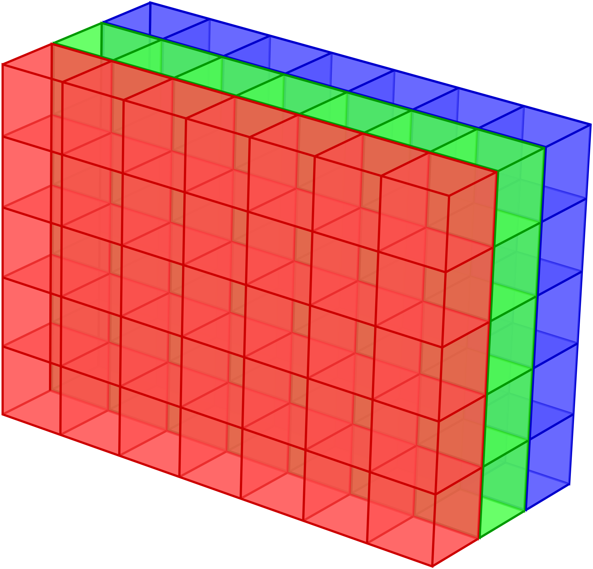

# Scientific computing with NumPy and SciPy

---

# Scientific Python ecosystem

<div>

Basis: [NumPy](https://numpy.org)

</div>


---

# Multidimensional Arrays

<div>example: digital colour image, M×N×3 data</div>

<br>



---

# Matrices and lists of lists

<div></div>

$\mathsf{M} = \begin{pmatrix} 1&2 \\ 3&4\end{pmatrix}$

```python
>>> m = [[1, 2], [3, 4]]
>>> m[0]
[1, 2]
>>> m[0][1]
2
>>> m[0][:]
[1, 2]
>>> m[:][0]
[1, 2]
```

<br>

* addressing columns does not work as it works for rows
* lists of lists are not efficient structures for numerical work

<br>

<carbon-arrow-right /> use NumPy arrays (`ndarray`) instead

---

# Import NumPy

```python
from numpy import *
```

* imports a very large namespace
* some of the function names exist also in other modules like `math`
  which can lead to confusion

<br>

```python
from numpy import array, cos, sin
```

* it is better to explicitly state in the code where the function
  comes from, in particular when confusion can arise

<br>

```python
import numpy
```

* this is acceptable but uncommon because `numpy` is unnecessarily long

<br>

```python
import numpy as np
```

* this way of importing NumPy is generally used and recommended <carbon-thumbs-up-filled style="color: #080;"/>

---

# Creating an array

<div>

a look into the documentation of `np.array`

</div>

```python {1-17|all}{maxHeight:'350px'}
>>> np.info(np.array)
array(object, dtype=None, *, copy=True, order='K', subok=False, ndmin=0,
      like=None)

Create an array.

Parameters
----------
object : array_like
    An array, any object exposing the array interface, an object whose
    ``__array__`` method returns an array, or any (nested) sequence.
    If object is a scalar, a 0-dimensional array containing object is
    returned.
dtype : data-type, optional
    The desired data-type for the array. If not given, NumPy will try to use
    a default ``dtype`` that can represent the values (by applying promotion
    rules when necessary.)
copy : bool, optional
    If true (default), then the object is copied.  Otherwise, a copy will
    only be made if ``__array__`` returns a copy, if obj is a nested
    sequence, or if a copy is needed to satisfy any of the other
    requirements (``dtype``, ``order``, etc.).
order : {'K', 'A', 'C', 'F'}, optional
    Specify the memory layout of the array. If object is not an array, the
    newly created array will be in C order (row major) unless 'F' is
    specified, in which case it will be in Fortran order (column major).
    If object is an array the following holds.

    ===== ========= ===================================================
    order  no copy                     copy=True
    ===== ========= ===================================================
    'K'   unchanged F & C order preserved, otherwise most similar order
    'A'   unchanged F order if input is F and not C, otherwise C order
    'C'   C order   C order
    'F'   F order   F order
    ===== ========= ===================================================

    When ``copy=False`` and a copy is made for other reasons, the result is
    the same as if ``copy=True``, with some exceptions for 'A', see the
    Notes section. The default order is 'K'.
subok : bool, optional
    If True, then sub-classes will be passed-through, otherwise
    the returned array will be forced to be a base-class array (default).
ndmin : int, optional
    Specifies the minimum number of dimensions that the resulting
    array should have.  Ones will be prepended to the shape as
    needed to meet this requirement.
like : array_like, optional
    Reference object to allow the creation of arrays which are not
    NumPy arrays. If an array-like passed in as ``like`` supports
    the ``__array_function__`` protocol, the result will be defined
    by it. In this case, it ensures the creation of an array object
    compatible with that passed in via this argument.

    .. versionadded:: 1.20.0

Returns
-------
out : ndarray
    An array object satisfying the specified requirements.

See Also
--------
empty_like : Return an empty array with shape and type of input.
ones_like : Return an array of ones with shape and type of input.
zeros_like : Return an array of zeros with shape and type of input.
full_like : Return a new array with shape of input filled with value.
empty : Return a new uninitialized array.
ones : Return a new array setting values to one.
zeros : Return a new array setting values to zero.
full : Return a new array of given shape filled with value.


Notes
-----
When order is 'A' and ``object`` is an array in neither 'C' nor 'F' order,
and a copy is forced by a change in dtype, then the order of the result is
not necessarily 'C' as expected. This is likely a bug.

Examples
--------
>>> np.array([1, 2, 3])
array([1, 2, 3])

Upcasting:

>>> np.array([1, 2, 3.0])
array([ 1.,  2.,  3.])

More than one dimension:

>>> np.array([[1, 2], [3, 4]])
array([[1, 2],
       [3, 4]])

Minimum dimensions 2:

>>> np.array([1, 2, 3], ndmin=2)
array([[1, 2, 3]])

Type provided:

>>> np.array([1, 2, 3], dtype=complex)
array([ 1.+0.j,  2.+0.j,  3.+0.j])

Data-type consisting of more than one element:

>>> x = np.array([(1,2),(3,4)],dtype=[('a','<i4'),('b','<i4')])
>>> x['a']
array([1, 3])

Creating an array from sub-classes:

>>> np.array(np.mat('1 2; 3 4'))
array([[1, 2],
       [3, 4]])

>>> np.array(np.mat('1 2; 3 4'), subok=True)
matrix([[1, 2],
        [3, 4]])
```

---

# Converting a list of lists into an `ndarray`

```python
>>> import numpy as np
>>> matrix = [[0, 1, 2],
...           [3, 4, 5],
...           [6, 7, 8]]
>>> myarray = np.array(matrix)
>>> myarray
array([[0, 1, 2],
       [3, 4, 5],
       [6, 7, 8]])
>>> type(myarray)
<class 'numpy.ndarray'>
```
```python
>>> myarray[0, :]
array([0, 1, 2])
>>> myarray[:, 0]
array([0, 3, 6])
```

* In contrast to lists of lists, the `ndarray` allows to access rows and columns
  in a consistent way.

---

# The structure of an `ndarray`

<div>

print attributes of an `ndarray`

</div>

```python
def array_attributes(a):
    for attr in ('ndim', 'size', 'itemsize', 'dtype', 'shape', 'strides'):
        print(f'{attr:8s}: {getattr(a, attr)}')
```

```python
>>> matrix = np.arange(10)
>>> matrix
array([0, 1, 2, 3, 4, 5, 6, 7, 8, 9])
>>> array_attributes(matrix)
ndim    : 1
size    : 10
itemsize: 8
dtype   : int64
shape   : (10,)
strides : (8,)
```

* `int64` benötigt 64 Bits oder 8 Bytes
* Die Schrittweite von einem Eintrag zum nächsten beträgt hier 8 Bytes.
* Durch die Homogenität der Daten lässt sich die Position eines bestimmten
  Eintrags direkt berechnen.
