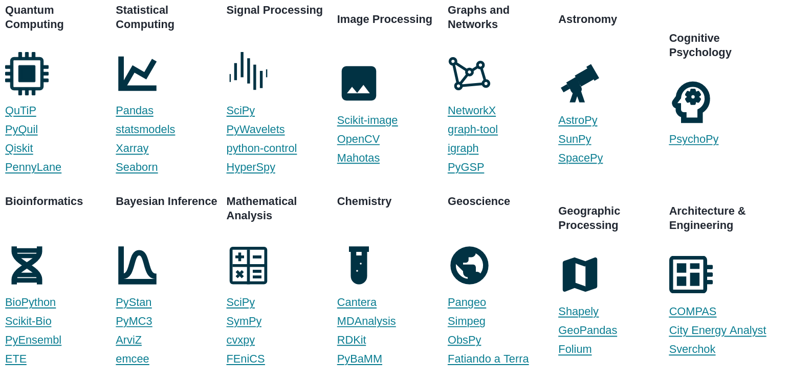
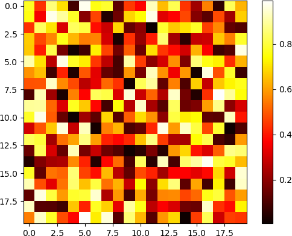

# Scientific computing with NumPy and SciPy

---

# Scientific Python ecosystem

<div>

Basis: [NumPy](https://numpy.org)

</div>



---

# Multidimensional Arrays

<div>example: digital colour image, M×N×3 data</div>

<br>


---

# Matrices and lists of lists

<div></div>

$\mathsf{M} = \begin{pmatrix} 1&2 \\ 3&4\end{pmatrix}$

```python
>>> m = [[1, 2], [3, 4]]
>>> m[0]
[1, 2]
>>> m[0][1]
2
>>> m[0][:]
[1, 2]
>>> m[:][0]
[1, 2]
```

<br>

* addressing columns does not work as it works for rows
* lists of lists are not efficient structures for numerical work

<br>

<carbon-arrow-right /> use NumPy arrays (`ndarray`) instead

---

# Import NumPy

```python
from numpy import *
```

* imports a very large namespace
* some of the function names exist also in other modules like `math`
  which can lead to confusion

<br>

```python
from numpy import array, cos, sin
```

* it is better to explicitly state in the code where the function
  comes from, in particular when confusion can arise

<br>

```python
import numpy
```

* this is acceptable but uncommon because `numpy` is unnecessarily long

<br>

```python
import numpy as np
```

* this way of importing NumPy is generally used and recommended <carbon-thumbs-up-filled style="color: #080;"/>

---

# Creating an array

<div>

a look into the documentation of `np.array`

</div>

```python {1-17|all}{maxHeight:'350px'}
>>> np.info(np.array)
array(object, dtype=None, *, copy=True, order='K', subok=False, ndmin=0,
      like=None)

Create an array.

Parameters
----------
object : array_like
    An array, any object exposing the array interface, an object whose
    ``__array__`` method returns an array, or any (nested) sequence.
    If object is a scalar, a 0-dimensional array containing object is
    returned.
dtype : data-type, optional
    The desired data-type for the array. If not given, NumPy will try to use
    a default ``dtype`` that can represent the values (by applying promotion
    rules when necessary.)
copy : bool, optional
    If true (default), then the object is copied.  Otherwise, a copy will
    only be made if ``__array__`` returns a copy, if obj is a nested
    sequence, or if a copy is needed to satisfy any of the other
    requirements (``dtype``, ``order``, etc.).
order : {'K', 'A', 'C', 'F'}, optional
    Specify the memory layout of the array. If object is not an array, the
    newly created array will be in C order (row major) unless 'F' is
    specified, in which case it will be in Fortran order (column major).
    If object is an array the following holds.

    ===== ========= ===================================================
    order  no copy                     copy=True
    ===== ========= ===================================================
    'K'   unchanged F & C order preserved, otherwise most similar order
    'A'   unchanged F order if input is F and not C, otherwise C order
    'C'   C order   C order
    'F'   F order   F order
    ===== ========= ===================================================

    When ``copy=False`` and a copy is made for other reasons, the result is
    the same as if ``copy=True``, with some exceptions for 'A', see the
    Notes section. The default order is 'K'.
subok : bool, optional
    If True, then sub-classes will be passed-through, otherwise
    the returned array will be forced to be a base-class array (default).
ndmin : int, optional
    Specifies the minimum number of dimensions that the resulting
    array should have.  Ones will be prepended to the shape as
    needed to meet this requirement.
like : array_like, optional
    Reference object to allow the creation of arrays which are not
    NumPy arrays. If an array-like passed in as ``like`` supports
    the ``__array_function__`` protocol, the result will be defined
    by it. In this case, it ensures the creation of an array object
    compatible with that passed in via this argument.

    .. versionadded:: 1.20.0

Returns
-------
out : ndarray
    An array object satisfying the specified requirements.

See Also
--------
empty_like : Return an empty array with shape and type of input.
ones_like : Return an array of ones with shape and type of input.
zeros_like : Return an array of zeros with shape and type of input.
full_like : Return a new array with shape of input filled with value.
empty : Return a new uninitialized array.
ones : Return a new array setting values to one.
zeros : Return a new array setting values to zero.
full : Return a new array of given shape filled with value.


Notes
-----
When order is 'A' and ``object`` is an array in neither 'C' nor 'F' order,
and a copy is forced by a change in dtype, then the order of the result is
not necessarily 'C' as expected. This is likely a bug.

Examples
--------
>>> np.array([1, 2, 3])
array([1, 2, 3])

Upcasting:

>>> np.array([1, 2, 3.0])
array([ 1.,  2.,  3.])

More than one dimension:

>>> np.array([[1, 2], [3, 4]])
array([[1, 2],
       [3, 4]])

Minimum dimensions 2:

>>> np.array([1, 2, 3], ndmin=2)
array([[1, 2, 3]])

Type provided:

>>> np.array([1, 2, 3], dtype=complex)
array([ 1.+0.j,  2.+0.j,  3.+0.j])

Data-type consisting of more than one element:

>>> x = np.array([(1,2),(3,4)],dtype=[('a','<i4'),('b','<i4')])
>>> x['a']
array([1, 3])

Creating an array from sub-classes:

>>> np.array(np.mat('1 2; 3 4'))
array([[1, 2],
       [3, 4]])

>>> np.array(np.mat('1 2; 3 4'), subok=True)
matrix([[1, 2],
        [3, 4]])
```

---

# Converting a list of lists into an `ndarray`

```python
>>> import numpy as np
>>> matrix = [[0, 1, 2],
...           [3, 4, 5],
...           [6, 7, 8]]
>>> myarray = np.array(matrix)
>>> myarray
array([[0, 1, 2],
       [3, 4, 5],
       [6, 7, 8]])
>>> type(myarray)
<class 'numpy.ndarray'>
```
```python
>>> myarray[0, :]
array([0, 1, 2])
>>> myarray[:, 0]
array([0, 3, 6])
```

* In contrast to lists of lists, the `ndarray` allows to access rows and columns
  in a consistent way.

<div class="mt-3 p-2 border-2 border-teal-800 bg-teal-50 text-teal-800">
  <div class="grid grid-cols-[2%_1fr] gap-4">
    <div><carbon-idea class="text-teal-800 text-xl" /></div>
    <div>
    <code>append</code> is frequently used to construct lists. Do not use it for arrays as this
    leads to significant performance loss.
    </div>
  </div>
</div>

---

# The structure of an `ndarray`

<div>

print attributes of an `ndarray`

</div>

```python
def array_attributes(a):
    for attr in ('ndim', 'size', 'itemsize', 'dtype', 'shape', 'strides'):
        print(f'{attr:8s}: {getattr(a, attr)}')
```

```python
>>> matrix = np.arange(16)
>>> matrix
array([ 0,  1,  2,  3,  4,  5,  6,  7,  8,  9, 10, 11, 12, 13, 14, 15])
>>> array_attributes(matrix)
ndim    : 1
size    : 16
itemsize: 8
dtype   : int64
shape   : (16,)
strides : (8,)
```

* `int64` requires 64 bits or 8 bytes, in total this array requires 128 bytes
* the stride from one entry to the next amounts to 8 bytes
* due to the homogeneity of the data, the position of a given entry can easily
  be determined

---

# The problem with finite precision

```python
>>> np.arange(1, 160, 10, dtype=np.int8)
array([   1,   11,   21,   31,   41,   51,   61,   71,   81,   91,  101,
        111,  121, -125, -115, -105], dtype=int8)
```

* `int8` refers to signed integers with 8 bits covering the range from -128 to 127
* be aware of the danger of overflow

<br>

<div class="p-2 border-2 border-red-800 bg-red-50 text-red-800">
  <div class="grid grid-cols-[4%_1fr] gap-10">
    <div><carbon-warning-alt class="text-red-800 text-3xl" /></div>
    <div>
     While integers in Python in principle can become arbitrarily large, this is
     not the case for integer <code>ndarray</code>s in NumPy!
    </div>
  </div>
</div>

<br>

#### Data types

<div class="grid grid-cols-[1fr_1fr_1fr_1fr_1fr] gap-6">
  <div>

  * int8
  * int16
  * int32
  * int64

  </div>
  <div>

  * uint8
  * uint16
  * uint32
  * uint64

  </div>
  <div>

  * float16
  * float32
  * float64
  * longdouble

  </div>
  <div>

  * complex64
  * complex128
  * clongdouble

  </div>
  <div>

  * bool
  * object
  * bytes
  * str
  * void

  </div>
</div>

---

# Shapes and strides

<div class="grid grid-cols-[40%_1fr] gap-6">
  <div>

```python
>>> matrix = np.arange(16).reshape(4, 4)
>>> matrix
array([[ 0,  1,  2,  3],
       [ 4,  5,  6,  7],
       [ 8,  9, 10, 11],
       [12, 13, 14, 15]])
>>> array_attributes(matrix)
ndim    : 2
size    : 16
itemsize: 8
dtype   : int64
shape   : (4, 4)
strides : (32, 8)
```

 * shapes and strides change the interpretation of data aligned in one dimension
 * data can be reinterpreted without copying data in memory

  </div>
  <div>


  </div>
</div>

---

# Avoid copying arrays

<div class="mt-3 ml-30 mr-30 p-4 border-2 border-teal-800 bg-teal-50 text-teal-800">
  <div class="grid grid-cols-[3%_1fr] gap-4">
    <div><carbon-idea class="text-teal-800 text-xl" /></div>
    <div>
     Moving around large blocks of data in memory can take a lot of time.
     Avoid making copies of arrays, if possible.
    </div>
  </div>
</div>

<br>

#### example: transposition of a matrix

```python
>>> a = np.arange(9).reshape(3, 3)
>>> a
array([[0, 1, 2],
       [3, 4, 5],
       [6, 7, 8]])
>>> a.strides
(24, 8)
>>> a.T
array([[0, 3, 6],
       [1, 4, 7],
       [2, 5, 8]])
>>> a.T.strides
(8, 24)
```

* no data are copied

---

# Be careful when modifiying strides

```python
>>> a = np.arange(16)
>>> a
array([ 0,  1,  2,  3,  4,  5,  6,  7,  8,  9, 10, 11, 12, 13, 14, 15])
```
```python
>>> a.shape = (4, 4)
>>> a.strides = (8, 8)
>>> a
array([[0, 1, 2, 3],
       [1, 2, 3, 4],
       [2, 3, 4, 5],
       [3, 4, 5, 6]])
```

* caution: changing an element here can imply changes of other elements as well

```python
>>> a.strides = (8, 4)
>>> a
array([[          0,  4294967296,           1,  8589934592],
       [          1,  8589934592,           2, 12884901888],
       [          2, 12884901888,           3, 17179869184],
       [          3, 17179869184,           4, 21474836480]])
```

* data are take as is
* not respecting data boundaries can lead to unintended results

---

# Initializing an array

* If an array cannot be created directly, an array of the desired size should
  be initialized. Do not use the `append` method.

```python
>>> a = np.zeros((2, 2))
>>> a
array([[0., 0.],
       [0., 0.]])
>>> a.dtype
dtype('float64')
```

* All elements are set to zero in this case.
* The default data type is `float64`.

```python
>>> a = np.zeros((2, 2), dtype=int)
>>> a
array([[0, 0],
       [0, 0]])
>>> a.dtype
dtype('int64')
```

* If a different data is needed, it should be specified through the `dtype` argument.

---

# Initializing an array (cont'd)

```python
>>> np.empty((3, 3))
array([[4.49105672e-320, 0.00000000e+000, 1.77459490e+248],
       [4.29058029e+270, 1.33733641e+160, 8.59372554e-096],
       [1.01021434e+141, 1.43180994e-065, 9.16526748e+242]])
```

* If all elements will be overwritten before usage anway, it is slightly more efficient
  not to set the elements but to leave the memory as is.

```python
>>> np.ones((2, 2))
array([[1., 1.],
       [1., 1.]])
```
```python
>>> 10*np.ones((2, 2))
array([[10., 10.],
       [10., 10.]])
```

* By multiplication, it is possible to feel an array homogeneously with the desired value.

---

# Structured matrices

```python
>>> np.identity(3)
array([[1., 0., 0.],
       [0., 1., 0.],
       [0., 0., 1.]])
```

* In this way, only square matrices can be created.

```python
>>> np.eye(2, 4)
array([[1., 0., 0., 0.],
       [0., 1., 0., 0.]])
>>> np.eye(4, k=1)
array([[0., 1., 0., 0.],
       [0., 0., 1., 0.],
       [0., 0., 0., 1.],
       [0., 0., 0., 0.]])
```

* With the `eye` method, also non-square unit matrices, possibly with a shifted diagonal, can be created 

```python
>>> 2*np.eye(4)-np.eye(4, k=1)-np.eye(4, k=-1)
array([[ 2., -1.,  0.,  0.],
       [-1.,  2., -1.,  0.],
       [ 0., -1.,  2., -1.],
       [ 0.,  0., -1.,  2.]])
```

---

# Diagonal matrices and diagonals

```python
>>> np.diag([1, 2, 3, 4])
array([[1, 0, 0, 0],
       [0, 2, 0, 0],
       [0, 0, 3, 0],
       [0, 0, 0, 4]])
```

* A two-dimensional diagonal matrix is generated from a one-dimensional sequence.

```python
>>> matrix = np.arange(16).reshape(4, 4)
>>> matrix
array([[ 0,  1,  2,  3],
       [ 4,  5,  6,  7],
       [ 8,  9, 10, 11],
       [12, 13, 14, 15]])
>>> np.diag(matrix)
array([ 0,  5, 10, 15])
```

* From a two-dimensional matrix which can even be non-square, the diagonal is extracted.

---

# Generating matrix elements by means of a function

#### Example: multiplication table

```python
>>> np.fromfunction(lambda i, j: (i+1)*(j+1), shape=(6, 6), dtype=int)
array([[ 1,  2,  3,  4,  5,  6],
       [ 2,  4,  6,  8, 10, 12],
       [ 3,  6,  9, 12, 15, 18],
       [ 4,  8, 12, 16, 20, 24],
       [ 5, 10, 15, 20, 25, 30],
       [ 6, 12, 18, 24, 30, 36]])
```

* This works also in more than two dimensions.

```python
>>> np.fromfunction(lambda i, j, k: (i+1)*(j+1)/(k+1), shape=(2, 2, 2))
array([[[1. , 0.5],
        [2. , 1. ]],

       [[2. , 1. ],
        [4. , 2. ]]])
````

---

# Equally-spaced values

```python
np.arange(1, 2, 0.1)
array([1. , 1.1, 1.2, 1.3, 1.4, 1.5, 1.6, 1.7, 1.8, 1.9])
```

* generalization of `range`
* final value is not generated
* step width is specified

<br>

```python
>>> np.linspace(1, 2, 11)
array([1. , 1.1, 1.2, 1.3, 1.4, 1.5, 1.6, 1.7, 1.8, 1.9, 2. ])
```

* number of elements is specified

```python
>>> np.linspace([1, 2], [2, -2], 11)
array([[ 1. ,  2. ],
       [ 1.1,  1.6],
       ⋮
       [ 1.9, -1.6],
       [ 2. , -2. ]])
```

* works also for lists and arrays

---

# Equally-spaced values (cont'd)

```python
>>> np.linspace(1, 4, 7, retstep=True)
(array([1. , 1.5, 2. , 2.5, 3. , 3.5, 4. ]), 0.5)
```

* It is possible to obtain the step width.
* It is possible to omit the last value (`endpoint=False`).

<br>

```python
>>> np.logspace(0, 3, 4)
array([   1.,   10.,  100., 1000.])
>>> np.logspace(0, 2, 5, base=2)
array([1.        , 1.41421356, 2.        , 2.82842712, 4.        ])
```

* logarithmic scales are possible as well
* default base is 10
* the first two arguments are to be understood as exponents

---

# Application of linspace

```python
import numpy as np
import matplotlib.pyplot as plt

x = np.linspace(0, 2*np.pi, 100)
y = np.sin(x)
plt.plot(x, y)
plt.show()
```


---

# Load data from a file

```python
# mydata.dat

# time position
   0.0   0.0
   0.1   0.1
   0.2   0.4
   0.3   0.9
```

```python
>>> np.loadtxt('mydata.dat')
array([[0. , 0. ],
       [0.1, 0.1],
       [0.2, 0.4],
       [0.3, 0.9]])
```

* `loadtxt` has a number of useful arguments, see [documentation](https://numpy.org/doc/stable/reference/generated/numpy.loadtxt.html#numpy-loadtxt)
* for a even more flexible way of reading data files, see [genfromtxt](https://numpy.org/doc/stable/reference/generated/numpy.genfromtxt.html#numpy-genfromtxt)

---

# Random arrays

```python
>>> rng = np.random.default_rng()
```

```python
>>> rng.random((2, 5))
array([[0.83225433, 0.62066329, 0.8186137 , 0.81388624, 0.93601643],
       [0.51750755, 0.00895467, 0.65958576, 0.59495482, 0.9500244 ]])
>>> rng.random((2, 5))
array([[0.62886203, 0.54529378, 0.73134872, 0.58461308, 0.34375939],
       [0.5687676 , 0.89653199, 0.60219157, 0.84906627, 0.10558733]])
```

* In order to make the random numbers reproducible, a seed can be specified.

```python
>>> rng = np.random.default_rng(1234546)
>>> rng.random((2, 5))
array([[0.41581531, 0.19749742, 0.47628191, 0.07599962, 0.75069401],
       [0.7087109 , 0.58950695, 0.97730533, 0.58801372, 0.81343677]])
>>> rng = np.random.default_rng(1234546)
>>> rng.random((2, 5))
array([[0.41581531, 0.19749742, 0.47628191, 0.07599962, 0.75069401],
       [0.7087109 , 0.58950695, 0.97730533, 0.58801372, 0.81343677]])
```

---

# Displaying an array of random numbers

<div class="grid grid-cols-[1fr_1fr] gap-4">
 <div>

```python
import matplotlib.pyplot as plt

rng = np.random.default_rng(42)
data = rng.random((20, 20))
plt.imshow(data, cmap=plt.cm.hot, interpolation='none')
plt.colorbar()
plt.show()
```

  </div>
  <div>

  </div>
</div>

* There exist a variety of different random number generators, e.g.:
  * `integers`: random integers between a lower and an upper value
  * `choice`: random choice of elements from an array with or without replacement
  * `shuffle`: shuffles an array in-place
  * `normal`: normally distributed random numbers
  * and many more, see [documentation](https://numpy.org/doc/stable/reference/random/generator.html)

---

# Indexing arrays

```python
>>> a = np.arange(10)
>>> a
array([0, 1, 2, 3, 4, 5, 6, 7, 8, 9])
```
```python
>>> a[:]
array([0, 1, 2, 3, 4, 5, 6, 7, 8, 9])
```
```python
>>> a[1:4]
array([1, 2, 3])
```
```python
>>> a[5:-2]
array([5, 6, 7])
```
```python
>>> a[::2]
array([0, 2, 4, 6, 8])
```
```python
>>> a[1::2]
array([1, 3, 5, 7, 9])
```
```python
>>> a[::-1]
array([9, 8, 7, 6, 5, 4, 3, 2, 1, 0])
```

* corresponds to the usual slicing syntax

---

# Array aliases and copies

<div class="grid grid-cols-[1fr_1fr] gap-4">
  <div>

```python
>>> a = np.arange(10)
>>> b = a
>>> b
array([0, 1, 2, 3, 4, 5, 6, 7, 8, 9])
>>> id(a), id(b)
(133258061830960, 133258061830960)
>>> b[0] = 42
>>> a
array([42,  1,  2,  3,  4,  5,  6,  7,  8,  9])
```

 * `b` is just an alias for `a`, not a different array

  </div>
  <div>

```python
>>> a = np.arange(10)
>>> b = a[:]
>>> b
array([0, 1, 2, 3, 4, 5, 6, 7, 8, 9])
>>> id(a), id(b)
(133258085410128, 133257805172912)
>>> b[0] = 42
>>> a
array([42,  1,  2,  3,  4,  5,  6,  7,  8,  9])
```

 * while a new object is generated, it refers to the same part of the memory

  </div>
</div>
<div class="grid grid-cols-[1fr_1fr] gap-4">
  <div>

```python
>>> a = np.arange(10)
>>> b = np.copy(a)
>>> b[0] = 42
>>> a
array([0, 1, 2, 3, 4, 5, 6, 7, 8, 9])
>>> b
array([42,  1,  2,  3,  4,  5,  6,  7,  8,  9])
```

  </div>
  <div>

 * a true copy is made by using the `copy`-method

  </div>
</div>

---

# Slicing in higher dimensions

<div class="grid grid-cols-[1fr_1fr] gap-4">
  <div>

```python
>>> a = np.arange(36).reshape(6, 6)
>>> a
array([[ 0,  1,  2,  3,  4,  5],
       [ 6,  7,  8,  9, 10, 11],
       [12, 13, 14, 15, 16, 17],
       [18, 19, 20, 21, 22, 23],
       [24, 25, 26, 27, 28, 29],
       [30, 31, 32, 33, 34, 35]])
```

```python
>>> a[:, :]
array([[ 0,  1,  2,  3,  4,  5],
       [ 6,  7,  8,  9, 10, 11],
       [12, 13, 14, 15, 16, 17],
       [18, 19, 20, 21, 22, 23],
       [24, 25, 26, 27, 28, 29],
       [30, 31, 32, 33, 34, 35]])
```
```python
>>> a[2:4, 3:6]
array([[15, 16, 17],
       [21, 22, 23]])
```

  </div>
  <div>

```python
>>> a[::2, ::3]
array([[ 0,  3],
       [12, 15],
       [24, 27]])
```
```python
>>> a[2::2, ::3]
array([[12, 15],
       [24, 27]])
```
```python
>>> a[2:4]
array([[12, 13, 14, 15, 16, 17],
       [18, 19, 20, 21, 22, 23]])
```

 * In the last example, the an implicit slice `::` is
   assummed for the second dimension (axis 1).

  </div>
</div>

---

# Array axes

#### Index notation for matrices

<br>

<div class="grid grid-cols-[3%_1fr_1fr] gap-4">
  <div>

  $a_{ij}$

  </div>
  <div>

 * first index ($i$) refers to row (axes 0)
 * second index ($j$) refers to column (axes 1)

  <br>

  

  </div>
  <div>
  Example: summation along different axes

  <br>

  ```python
>>> a = np.arange(16).reshape(4, 4)
>>> a
array([[ 0,  1,  2,  3],
       [ 4,  5,  6,  7],
       [ 8,  9, 10, 11],
       [12, 13, 14, 15]])
```
```python
>>> a.sum(axis=0)
array([24, 28, 32, 36])
```
```python
>>> a.sum(axis=1)
array([ 6, 22, 38, 54])
```
```python
>>> a.sum()
120
```

  </div>
</div>
