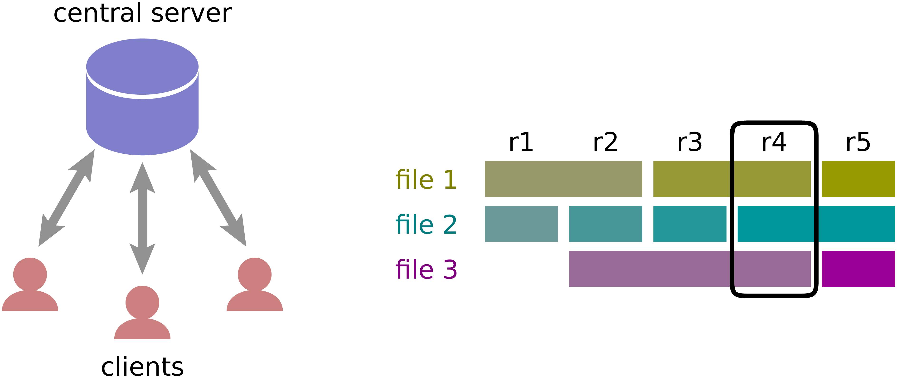
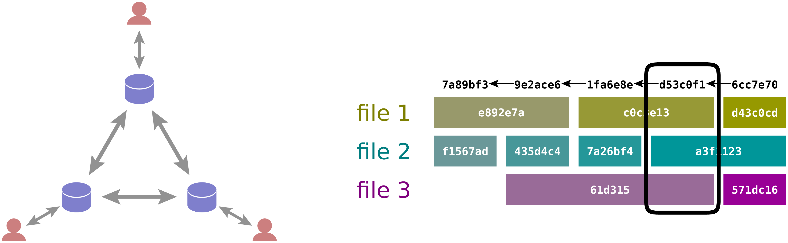
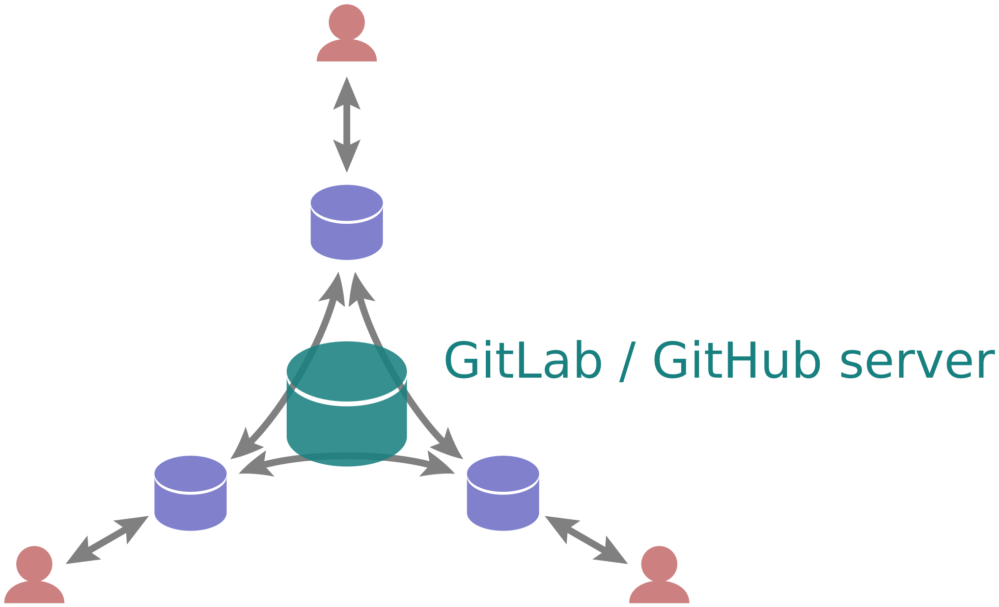
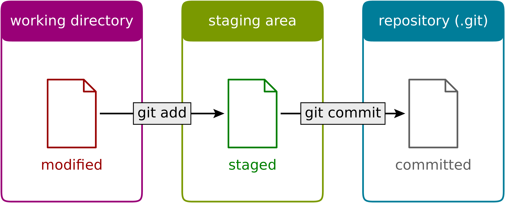
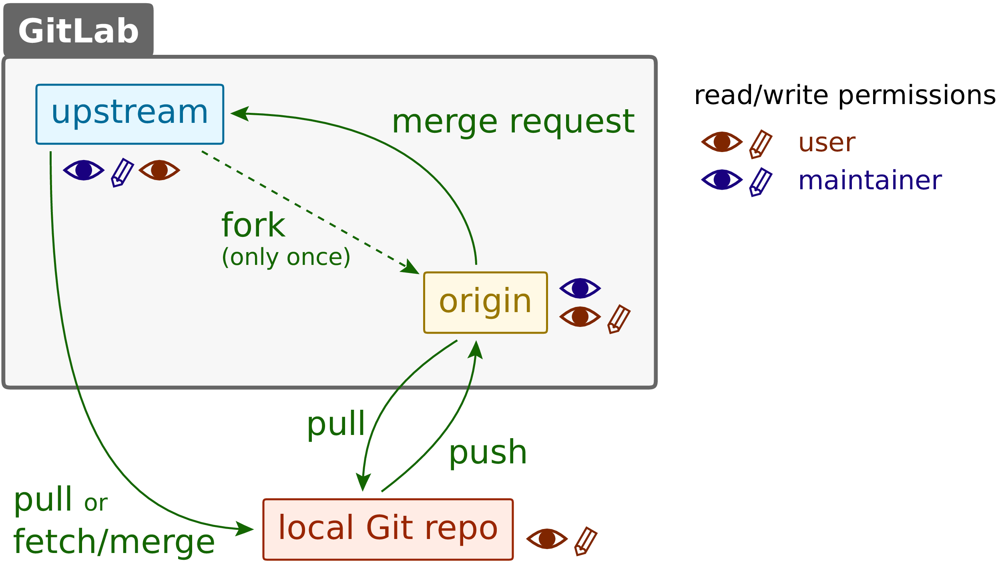

---
# try also 'default' to start simple
theme: default
# random image from a curated Unsplash collection by Anthony
# like them? see https://unsplash.com/collections/94734566/slidev
background: images/cover.png
# some information about your slides, markdown enabled
title: Method Course Tools for Scientific Computing
info: false
author: Gert-Ludwig Ingold
# apply any unocss classes to the current slide
# class: text-center
# https://sli.dev/custom/highlighters.html
highlighter: shiki
# https://sli.dev/guide/drawing
drawings:
  persist: false
# slide transition: https://sli.dev/guide/animations#slide-transitions
transition: slide-left
# enable MDC Syntax: https://sli.dev/guide/syntax#mdc-syntax
mdc: true
#
aspectRatio: 16/9
---

# Method Course
# Tools for Scientific Computing
### Gert-Ludwig Ingold

<br>

<div class="pt-12">
  <div>
    <carbon-logo-github /> <a href="https://github.com/gertingold/tools4scicomp">https://github.com/gertingold/tools4scicomp</a>
  </div>
  <div>
    <carbon-launch /> <a href="https://gertingold.github.io/tools4scicomp">https://gertingold.github.io/tools4scicomp</a>
  </div>
</div>

<!--
The last comment block of each slide will be treated as slide notes. It will be visible and editable in Presenter Mode along with the slide. [Read more in the docs](https://sli.dev/guide/syntax.html#notes)
-->

<style>
h1{ color: white; }
</style>

---

# Topics

* Version control with Git
* Testing of code
* Scientific computing with NumPy and SciPy
* Run-time analysis
* Documentation of code
* Aspects of parallel computing

<br>

* any suggestions or wishes from the audience?

<!--
Here is another comment.
-->

---
layout: gli-two-cols-header
---

# How does the method course work?

::left::

### Where and when

* lecture: 2 hours  
  Monday, 8h15 – 9h45, S-448
* practical work: 4 hours    
  Monday, 14h – 17h, S-448  

<br>

### What can be earned

* a lot of useful knowledge, but also:
* 8 credit points
* Master Materials Science and Engineering
  - Methods in Materials Science
* Master Physics
  - physics elective area

::right::

### Practical work

* programming project
* carried out in small groups of two or three persons
* extends typically over the full semester
* includes all aspects taught in the course like the use of
  version control, writing of unit tests, documentation, ...
* in order to earn credit points: the project repository including
  source code, tests etc. and the documentation have to be handed in
  by the end of the semester
  
---
layout: section
---

# Version control with Git

---

# Why do we need version control?

#### Software is developed iteratively
- code is added
- errors are fixed
- code is improved or refactored

<br>

#### <carbon-arrow-right /> It is important to keep a version history.
- apparent improvements  might turn out to lead to non-functional code
- it might be important to know whether certain numerical results were affected by an error
- design decisions can be documented

<br>

#### Why not simply keep one or more backup copies?
- naming can become unsystematic very easily
- for larger projects seeing all backup copies is distracting
- differences between versions are not easily accessible

---

# Short history of version control systems

<div class="grid grid-cols-[10%_1fr] gap-4">
  <div>1972</div><div>SCCS (source code control system)</div>
  <div>1982</div><div>RCS (revision control system)</div>
  <div>1990</div><div>CVS (concurrent versions system)</div>
  <div>2000</div><div>Subversion</div>
  <div>2005</div><div><span style="color: #aa0000;">Git</span>, Mercurial, Bazaar</div>
</div>

<br>

Git is a very popular version control system, in particular for the development of
open-source software. This makes code of scientific libraries like NumPy or SciPy easily
accessible for inspection.

The university hosts its own GitLab instance: `git.rz.uni-augsburg.de`

---
layout: quote
---

## *Why the name Git?*
<br>

<div class="grid grid-cols-[4%_1fr] gap-4">
<div><carbon-quotes class="text-3xl"/></div><div>
  It's the British slang term for stupid, despicable person ― arse. 
   The joke "I name all my projects for myself, first Linux, then git"
   was just too good to pass up. But it is also short, easy-to-say, and
   type on a standard keyboard. And reasonably unique and not any standard
   command, which is unusual.
</div></div>
 
<br>
 
<div style="text-align: right">
Linus Torvalds <a href="https://www.wired.com/2012/02/github-2/"><carbon-launch /></a>
</div>

---

# Collaborative software development

#### How are versions shared among developers?
  - centralized version control systems, e.g. Subversion  
    at each moment in time the server contains well-defined revision of the code
  - distributed version control systems, e.g. Git  
    different computers may have different versions

<br>

#### What if developers work in parallel, what should be done in case of conflicts?
  - need to handle merge conflicts

<br>

While parallel editing of text like in Overleaf or Google docs may make sense, code needs a consistent
version to allow e.g. for testing.
  
<div class="mt-3 p-2 border-2 border-teal-800 bg-teal-50 text-teal-800">
  <div class="grid grid-cols-[2%_1fr] gap-4">
    <div><carbon-idea class="text-teal-800 text-xl" /></div>
    <div>
The use of a version control system is no substitute for project management and  for attributing tasks to developers.
    </div>
  </div>
</div>

---

# Centralized version control systems

<br>



<br>

* sequential revisions of project states encompassing all files present at a certain moment
* an internet connection to the server is needed in order to record changes and create a new revision

---

# Distributed version control system

<br>



<br>

* there is no longer a global squential numbering
* instead files and commits, i.e. sets of files, are characterized by hash values
  depending on the content
* histories of different users may differ
* users can create new versions without internet connection favoring atomic commits

<br>

* How is collaboration possible in a distributed setup while respecting access permissions?

---

# Distributed version control system with central server

<div>In practice, even for a distributed version control system there is a central
server through which users exchange their versions.</div>

<br>



<br>

* exchange of versions between collaborating users via a GitLab server or GitHub
* user does not need to be connected to server in order to commit new versions
* GitLab instances, e.g. `git.rz.uni-augsburg.de`, access via computing center credentials
* GitHub ([github.com](https://github.com))

---

# Git

<div>
  
Webpage:  [git-scm.com](https://git-scm.com)
  
</div>

* Git software for Linux, macOS, Windows
* GUIs, e.g. for Windows: TortoiseGit  
  - IDEs often offer Git integration  
  - we will use Git on the command line
* documentation ([git-scm.com/doc](https://git-scm.com/doc))
  - man pages ([git-scm.com/docs](https://git-scm.com/docs))
  - Pro Git book ([git-scm.com/book/en/v2](https://git-scm.com/book/en/v2)), electronic version free
  - cheat sheets: [training.github.com](https://training.github.com/), [ndpsoftware.com/git-cheatsheet.htm](https://ndpsoftware.com/git-cheatsheet.htm)

---

# Getting help on Git

```text {1|2-}{maxHeight:'450px'}
$ git help
usage: git [--version] [--help] [-C <path>] [-c <name>=<value>]
           [--exec-path[=<path>]] [--html-path] [--man-path] [--info-path]
           [-p | --paginate | -P | --no-pager] [--no-replace-objects] [--bare]
           [--git-dir=<path>] [--work-tree=<path>] [--namespace=<name>]
           [--super-prefix=<path>] [--config-env=<name>=<envvar>]
           <command> [<args>]

These are common Git commands used in various situations:

start a working area (see also: git help tutorial)
   clone     Clone a repository into a new directory
   init      Create an empty Git repository or reinitialize an existing one

work on the current change (see also: git help everyday)
   add       Add file contents to the index
   mv        Move or rename a file, a directory, or a symlink
   restore   Restore working tree files
   rm        Remove files from the working tree and from the index

examine the history and state (see also: git help revisions)
   bisect    Use binary search to find the commit that introduced a bug
   diff      Show changes between commits, commit and working tree, etc
   grep      Print lines matching a pattern
   log       Show commit logs
   show      Show various types of objects
   status    Show the working tree status

grow, mark and tweak your common history
   branch    List, create, or delete branches
   commit    Record changes to the repository
   merge     Join two or more development histories together
   rebase    Reapply commits on top of another base tip
   reset     Reset current HEAD to the specified state
   switch    Switch branches
   tag       Create, list, delete or verify a tag object signed with GPG

collaborate (see also: git help workflows)
   fetch     Download objects and refs from another repository
   pull      Fetch from and integrate with another repository or a local branch
   push      Update remote refs along with associated objects

'git help -a' and 'git help -g' list available subcommands and some
concept guides. See 'git help <command>' or 'git help <concept>'
to read about a specific subcommand or concept.
See 'git help git' for an overview of the system.

```

---

# Getting help on a subcommand

<div></div>example:

```text {1|2-}{maxHeight:'400px'}
$ git --help init
GIT-INIT(1)                                   Git Manual                                  GIT-INIT(1)

NAME
       git-init - Create an empty Git repository or reinitialize an existing one

SYNOPSIS
       git init [-q | --quiet] [--bare] [--template=<template_directory>]
                 [--separate-git-dir <git dir>] [--object-format=<format>]
                 [-b <branch-name> | --initial-branch=<branch-name>]
                 [--shared[=<permissions>]] [directory]

DESCRIPTION
       This command creates an empty Git repository - basically a .git directory with subdirectories
       for objects, refs/heads, refs/tags, and template files. An initial branch without any commits
       will be created (see the --initial-branch option below for its name).

       If the $GIT_DIR environment variable is set then it specifies a path to use instead of ./.git
       for the base of the repository.

       If the object storage directory is specified via the $GIT_OBJECT_DIRECTORY environment
       variable then the sha1 directories are created underneath - otherwise the default
       $GIT_DIR/objects directory is used.

       Running git init in an existing repository is safe. It will not overwrite things that are
       already there. The primary reason for rerunning git init is to pick up newly added templates
       (or to move the repository to another place if --separate-git-dir is given).

OPTIONS
       -q, --quiet
           Only print error and warning messages; all other output will be suppressed.

       --bare
           Create a bare repository. If GIT_DIR environment is not set, it is set to the current
           working directory.

       --object-format=<format>
           Specify the given object format (hash algorithm) for the repository. The valid values are
           sha1 and (if enabled) sha256.  sha1 is the default.

           THIS OPTION IS EXPERIMENTAL! SHA-256 support is experimental and still in an early stage.
           A SHA-256 repository will in general not be able to share work with "regular" SHA-1
           repositories. It should be assumed that, e.g., Git internal file formats in relation to
           SHA-256 repositories may change in backwards-incompatible ways. Only use
           --object-format=sha256 for testing purposes.

       --template=<template_directory>
           Specify the directory from which templates will be used. (See the "TEMPLATE DIRECTORY"
           section below.)

       --separate-git-dir=<git dir>
           Instead of initializing the repository as a directory to either $GIT_DIR or ./.git/,
           create a text file there containing the path to the actual repository. This file acts as
           filesystem-agnostic Git symbolic link to the repository.

           If this is reinitialization, the repository will be moved to the specified path.

       -b <branch-name>, --initial-branch=<branch-name>
           Use the specified name for the initial branch in the newly created repository. If not
           specified, fall back to the default name (currently master, but this is subject to change
           in the future; the name can be customized via the init.defaultBranch configuration
           variable).

       --shared[=(false|true|umask|group|all|world|everybody|0xxx)]
           Specify that the Git repository is to be shared amongst several users. This allows users
           belonging to the same group to push into that repository. When specified, the config
           variable "core.sharedRepository" is set so that files and directories under $GIT_DIR are
           created with the requested permissions. When not specified, Git will use permissions
           reported by umask(2).

           The option can have the following values, defaulting to group if no value is given:

           umask (or false)
               Use permissions reported by umask(2). The default, when --shared is not specified.

           group (or true)
               Make the repository group-writable, (and g+sx, since the git group may be not the
               primary group of all users). This is used to loosen the permissions of an otherwise
               safe umask(2) value. Note that the umask still applies to the other permission bits
               (e.g. if umask is 0022, using group will not remove read privileges from other
               (non-group) users). See 0xxx for how to exactly specify the repository permissions.

           all (or world or everybody)
               Same as group, but make the repository readable by all users.

           0xxx
               0xxx is an octal number and each file will have mode 0xxx.  0xxx will override users'
               umask(2) value (and not only loosen permissions as group and all does).  0640 will
               create a repository which is group-readable, but not group-writable or accessible to
               others.  0660 will create a repo that is readable and writable to the current user and
               group, but inaccessible to others.

       By default, the configuration flag receive.denyNonFastForwards is enabled in shared
       repositories, so that you cannot force a non fast-forwarding push into it.

       If you provide a directory, the command is run inside it. If this directory does not exist, it
       will be created.
       
TEMPLATE DIRECTORY
       Files and directories in the template directory whose name do not start with a dot will be
       copied to the $GIT_DIR after it is created.

       The template directory will be one of the following (in order):

       •   the argument given with the --template option;

       •   the contents of the $GIT_TEMPLATE_DIR environment variable;

       •   the init.templateDir configuration variable; or

       •   the default template directory: /usr/share/git-core/templates.

       The default template directory includes some directory structure, suggested "exclude patterns"
       (see gitignore(5)), and sample hook files.

       The sample hooks are all disabled by default. To enable one of the sample hooks rename it by
       removing its .sample suffix.

       See githooks(5) for more general info on hook execution.

EXAMPLES
       Start a new Git repository for an existing code base

               $ cd /path/to/my/codebase
               $ git init      (1)
               $ git add .     (2)
               $ git commit    (3)

           1. Create a /path/to/my/codebase/.git directory.
           2. Add all existing files to the index.
           3. Record the pristine state as the first commit in the history.

GIT
       Part of the git(1) suite

Git 2.34.1                                    07/07/2023                                  GIT-INIT(1)


```

---

# Some topical guides on Git

```text {1|2-}{maxHeight:'450px'}
$ git help -g

The Git concept guides are:
   attributes          Defining attributes per path
   cli                 Git command-line interface and conventions
   core-tutorial       A Git core tutorial for developers
   credentials         Providing usernames and passwords to Git
   cvs-migration       Git for CVS users
   diffcore            Tweaking diff output
   everyday            A useful minimum set of commands for Everyday Git
   faq                 Frequently asked questions about using Git
   glossary            A Git Glossary
   hooks               Hooks used by Git
   ignore              Specifies intentionally untracked files to ignore
   mailmap             Map author/committer names and/or E-Mail addresses
   modules             Defining submodule properties
   namespaces          Git namespaces
   remote-helpers      Helper programs to interact with remote repositories
   repository-layout   Git Repository Layout
   revisions           Specifying revisions and ranges for Git
   submodules          Mounting one repository inside another
   tutorial            A tutorial introduction to Git
   tutorial-2          A tutorial introduction to Git: part two
   workflows           An overview of recommended workflows with Git

'git help -a' and 'git help -g' list available subcommands and some
concept guides. See 'git help <command>' or 'git help <concept>'
to read about a specific subcommand or concept.
See 'git help git' for an overview of the system.
```

---
layout: gli-two-cols-header
---

# First step: Setting up a local repository

::left::

#### create a new directory for the repository

```text
$ mkdir <myrepo>
$ cd <myrepo>
```

* `<myrepo>` should be replaced by a suitable name
* `mkdir` = **m**a**k**e **dir**ectory
* `cd` = **c**hange **d**irectory

<br>

#### a hidden subdirectory `.git` has been created

```text
$ ls -a
.  ..  .git
```

* `ls`: **l**i**s**t content of directory
* option `-a`: do not ignore entries starting with `.`


::right::

#### content of the `.git` directory

```text
$ ls -l .git
total 32
-rw-rw-r-- 1 gli gli   23 Apr 12 10:47 HEAD
drwxrwxr-x 2 gli gli 4096 Apr 12 10:47 branches
-rw-rw-r-- 1 gli gli   92 Apr 12 10:47 config
-rw-rw-r-- 1 gli gli   73 Apr 12 10:47 description
drwxrwxr-x 2 gli gli 4096 Apr 12 10:47 hooks
drwxrwxr-x 2 gli gli 4096 Apr 12 10:47 info
drwxrwxr-x 4 gli gli 4096 Apr 12 10:47 objects
drwxrwxr-x 4 gli gli 4096 Apr 12 10:47 refs
```

* option `-l`: long listing format

<br>

<div class="p-2 border-2 border-red-800 bg-red-50 text-red-800">
  <div class="grid grid-cols-[4%_1fr] gap-10">
    <div><carbon-warning-alt class="text-red-800 text-3xl" /></div>
    <div>
      The directory <code>.git</code> is where the repository lives.
      Do not delete this directory or tamper with it. Otherwise
      your work might be lost.
      <br>
      You have been warned!
    </div>
  </div>
</div>

---

# Personalize your repository

<div></div>
Git records the name of the user committing changes to the code. It therefore needs to know who you are.

This information later can help to find out who introduced a mistake or who added an important piece of code.

```text
$ git config --global user.name <your name>
$ git config --global user.email <your email>
```

* enclose argument in double quotes if it contains whitespace, e.g. the name
* The commands above configure name and email globally, so that this step is only needed once. A local
  configuration per repository is also possible, e.g. if another email address should be used.
* Many aspects of Git can be configured. For details see [chapter 8.1 of the Pro Git book](https://git-scm.com/book/en/v2/Customizing-Git-Git-Configuration).  
  Example: configuration of a default editor
  ```text
  $ git config --global core.editor vim
  ```
* list configuration
  ```text
  $ git config --list
  user.name=Gert-Ludwig Ingold
  user.email=gert.ingold@physik.uni-augsburg.de
  ⋮
  ```
  
---

# Basic workflow in a local repository

<br>



<br>

* modifications to several files can be combined in the staging area to a single commit
* a file can exist in different versions at the same time
  - a committed version in the local repository
  - a version staged for going to be committed
  - the version in the working directory which may already contain additional modifications
  - It is possible to move a file from the staging are back to the working directory (see later).

---

# The state of affairs

#### `git status` gives valuable information about the repository.

* On which branch are we?
* status relative to the corresponding remote branch
* files staged for commit including help how to remove files from the staging area
* files in the working directory and known to Git but containing additional modifications
* untracked files

<br>

#### immediately after initialization the status is as follows

```text {1|2|4|6}
$ git status
On branch master

No commits yet

nothing to commit (create/copy files and use "git add" to track)
```

<v-click>

<div class="mt-3 p-2 border-2 border-teal-800 bg-teal-50 text-teal-800">
  <div class="grid grid-cols-[2%_1fr] gap-4">
    <div><carbon-idea class="text-teal-800 text-xl" /></div>
    <div>
    Use <code>git status</code> frequently, in particular when unsure whether things are running correctly.
    </div>
  </div>
</div>

</v-click>

---

# A new file

```python
# hello.py
print("Hello world!")
```

<br>

```text {1|6-8}
$ git status
On branch master

No commits yet

Untracked files:
  (use "git add <file>..." to include in what will be committed)
        hello.py

nothing added to commit but untracked files present (use "git add" to track)
```

<br>

* there is a new file not known to Git so far
* the file can be added to the staging area by means of `git add`

---

# Adding the file to the staging area

```text
git add hello.py
```

<br>

```text {1|6-8}
$ git status
On branch master

No commits yet

Changes to be committed:
  (use "git rm --cached <file>..." to unstage)
        new file:   hello.py

```

<br>

* The file `hello.py` has been added to the staging area and can be committed to the Git
  repository in the next step.
* The file is still present in the working directory.
* Additional files can be added to the staging area in order to commit them together.
* Git tells us how to unstage the file if necessary.

---

# Further modification of the uncommitted file

````md magic-move
```python
# hello.py
print("Hello world!")
```
```python
# hello.py
for n in range(3):
    print("Hello world!")
```
````

<v-click>
```text {1|4|6-8|10-13}
$ git status
On branch master

No commits yet

Changes to be committed:
  (use "git rm --cached <file>..." to unstage)
        new file:   hello.py

Changes not staged for commit:
  (use "git add <file>..." to update what will be committed)
  (use "git restore <file>..." to discard changes in working directory)
        modified:   hello.py
```
</v-click>

<v-after>

* two different versions of the script, one in the working directory, the other one in the staging
  area
* different options:
  - commit first version, add second version and commit it → two commit messages
  - add second version and commit everything → only one commit message

</v-after>

---

# Our first commit

```text
$ git commit -m 'simple hello world script added'
[master (root-commit) 11e2d07] simple hello world script added
 1 file changed, 1 insertion(+)
 create mode 100644 hello.py
```

* argument `-m` contains commit message (preferably less than 50 characters)
* Alternatively, option `-m` can be omitted. Then, an editor will be opened to enter the commit
  message which can consist of a single line or a single line and some additional text separated
  by an empty line.

```text
$ git status
On branch master
Changes not staged for commit:
  (use "git add <file>..." to update what will be committed)
  (use "git restore <file>..." to discard changes in working directory)
        modified:   hello.py

no changes added to commit (use "git add" and/or "git commit -a")
```

* There exist further changes (the loop) which could now be staged and committed.

---

# Adding and committing

```text
$ git commit -a -m 'repetition of hello world implemented'
[master 52b9aa8] repetition of hello world implemented
 1 file changed, 2 insertions(+), 1 deletion(-)
```

* For a single file, option `-a` adds the file to the staging area and commits it at the same time.

<br>

```text
$ git status
On branch master
nothing to commit, working tree clean
```

* The changes are committed to the repository and presently there is nothing to add to the
  staging area or to commit to the repository.

<br>

#### Basic step

* add changes (or a new file) to the staging area and then commit to the repository
* Changes to several files can be collected in a single commit. This makes particularly sense
  when the changes are logically connected. 

---

# Commit history

```text {1|2-6|8-12}
$ git log
commit 52b9aa80d2441b3d8a7363affbffb9694ee16750 (HEAD -> master)
Author: Gert-Ludwig Ingold <gert.ingold@physik.uni-augsburg.de>
Date:   Fri Apr 12 16:19:41 2024 +0200

    repetition of hello world implemented

commit 11e2d079a65485959e1aa62a0af5d9a5fbebf8d4
Author: Gert-Ludwig Ingold <gert.ingold@physik.uni-augsburg.de>
Date:   Fri Apr 12 16:12:18 2024 +0200

    simple hello world script added
```

* most recent commit at top
* So far, the history is linear, but later there will be parallel branches even for a single user.
  Therefore, there cannot be a counter associated with the commits. Instead, a hash value is used.
* File versions, entire commits, etc. are characterized by a hash value which
  - is used to identify objects and to organize them in the `.git` directory
  - allows to decide easily whether a file has been modified

---

# Secure Hash Algorithm 1 (SHA1)

```text
$ echo Python | sha1sum
79c4e0b5abbd2f67a369ba6ee0b95438c38eb0cb  -
$ echo python | sha1sum
32886514c2621f81e01024aa84d0f829d2ce1fad  -
```

<br>

* Even small differences lead to huge changes in the SHA1 value.
* 160 bits implies 2<sup>160</sup> ≈ 1.46·10<sup>48</sup> different hash values. The same SHA1 value
  for different strings is highly unlikely but not excluded.
* SHA1 has should no longer be used for security-related applications like cryptographic signing.

<br>

* For practical purposes with Git, it is usually sufficient to specify the first 6 or 7 hexadecimal
  digits of the hash value in order to uniquely identify a commit.

---

# How often to commit?

* In a distributed version control system it is possible to commit as often as one wishes
  because no internet connectivity is needed.
  
<div class="mt-3 p-2 border-2 border-teal-800 bg-teal-50 text-teal-800">
  <div class="grid grid-cols-[2%_1fr] gap-4">
    <div><carbon-idea class="text-teal-800 text-xl" /></div>
    <div>
    <b>atomic commit</b><br>
    collect all modifications associated with one minimal logical change in one commit
    </div>
  </div>
</div>

<br>

* Do not combine different logical changes in a single commit. This might later help to revert well defined changes.
* `git add -p`: The option `-p` is helpful when you want to stage only some of the changes which you have made.
* At the beginning of a project, atomic commits might not be that useful.
* Atomic commits might be more useful for code development but less when a text or a presentation is developped
  in a version control system.
* In the end it is up to you to decide what best suits your needs.

---

# Let us slightly refactor our code

````md magic-move
```python
# hello.py
for n in range(3):
    print("Hello world!")
```
```python
#hello.py
repeated_print("Hello world!", 3)
```
```python
#hello.py
from repeat import repeated_print

repeated_print("Hello world!", 3)
```
````

<v-click>
```python
# repeat.py
def repeated_print(text, repetitions):
    for n in range(repetitions):
        print(text)
```
</v-click>

<br>

<v-click>
Let us check whether the code still works:

```text
$ python hello.py
Hello world!
Hello world!
Hello world!
```
</v-click>

---

# Irrelevant objects appear

```text {all|8,10,11}
$ git status
On branch master
Changes not staged for commit:
  (use "git add <file>..." to update what will be committed)
  (use "git restore <file>..." to discard changes in working directory)
        geändert:       hello.py

Untracked files:
  (use "git add <file>..." to include in what will be committed)
        __pycache__/
        repeat.py

no changes added to commit (use "git add" and/or "git commit -a")
```

```text {hide|1|5,8,10}
$ ls -lR
.:
insgesamt 12
-rw-rw-r-- 1 gert gert   69 Apr 13 13:42 hello.py
drwxrwxr-x 2 gert gert 4096 Apr 13 13:42 __pycache__
-rw-rw-r-- 1 gert gert   92 Apr 13 13:42 repeat.py

./__pycache__:
insgesamt 4
-rw-rw-r-- 1 gert gert 393 Apr 13 13:42 repeat.cpython-311.pyc
```

---

# Let Git ignore objects

```text
# .gitignore
__pycache__/
```

```text {hide|all|8,10-11}
$ git status
On branch master
Changes not staged for commit:
  (use "git add <file>..." to update what will be committed)
  (use "git restore <file>..." to discard changes in working directory)
        modified:   hello.py

Untracked files:
  (use "git add <file>..." to include in what will be committed)
        .gitignore
        repeat.py

no changes added to commit (use "git add" and/or "git commit -a")
```

* the directory `__pycache__/` is no longer listed
* wildcards can be used: `*.py[cod]` corresponds to all files with extensions `pyc`, `pyo`, or `pyd`
* put `.gitignore` into version control
* [github.com/github/gitignore](https://github.com/github/gitignore) contains a number of
  `.gitignore` files for different languages

---

# The `master` branch 

* So far, we have been working with only one branch.
* This branch was called `master` but the name is not really important. GitHub uses the name `main`
  instead.
* There can be other branches, e.g. to separate production code and development code.
* In addition to local branches, there can be remote branches.

<br>

```text
$ git log --oneline --graph --decorate --all
* 4a97579 (HEAD -> master) .gitignore for Python added
* 0c227f4 hello world script refactored
* 52b9aa8 repetition of hello world implemented
* 11e2d07 simple hello world script added
```

* So far, we have a linear history involving only the branch `master`.
* In our working directory, we have commit `4a97579` which is referred to as `HEAD`.

---

# Creating a development branch

```text
$ git branch
* master
```

* We only have one branch and the asterisk indicates that this is the branch on which we are at present.

<br>

* Create a development branch called `dev`. Other names could be used as well to identify the branch.

```text
$ git switch -c dev
Switched to a new branch 'dev'
```

* `switch` switches the branch, `-c` implies creation of a new branch.

```text {all|2}
$ git branch
* dev
  master
```

<br>
Alternative:

```text
$ git branch dev
$ git switch dev
```

---

# Switching back and forth

```text
$ git branch
* dev
  master
```

```text
$ git switch master
Switched to branch »master«
```

```text
$ git branch
  dev
* master
```

```text
$ git switch dev
Switched to branch »dev«
```

```text {all|2}
git log  --oneline --graph --decorate=short --all
* 4a97579 (HEAD -> dev, master) .gitignore for Python added
* 0c227f4 hello world script refactored
* 52b9aa8 repetition of hello world implemented
* 11e2d07 simple hello world script added
```

* `HEAD` is now pointing to the `dev` branch.
* Commit `4a97579` belongs both to the `master` branch and the `dev` branch.

---

# Let us do some work in the `dev` branch

````md magic-move
```python
#hello.py
from repeat import repeated_print

repeated_print("Hello world!", 3)
```
```python
# hello.py
from repeat import repeated_print

def hello(name="", repetitions=1):
    if name:
        repeated_print(f"Hello, {name}", repetitions)
    else:
        repeated_print("Hello world!", repetitions)
```
````

```text {hide|all|2,3}
$ git log --oneline --graph --decorate --all
* d5a8fb8 (HEAD -> dev) name as new argument implemented
* 4a97579 (master) .gitignore for Python added
* 0c227f4 hello world script refactored
* 52b9aa8 repetition of hello world implemented
* 11e2d07 simple hello world script added
```

<br>

<v-click>

* Commit `d5a8fb8` is on the branch `dev` while master is still at commit `4a97579`.
* So far, the history is still linear.

</v-click>

---

# Switching back and forth

#### `dev` branch

```text {all|2}
$ git branch
* dev
  master
```

```text
$ cat hello.py
from repeat import repeated_print

def hello(name="", repetitions=1):
    if name:
        repeated_print(f"Hello, {name}", repetitions)
    else:
        repeated_print("Hello world!", repetitions)
```

#### `master` branch

```text
$ git switch master
Switched to branch »master«
```
```text
$ cat hello.py
from repeat import repeated_print

repeated_print("Hello world!", 3)
```

---

# Improvement in the `master` branch
  
<div class="mt-3 p-2 border-2 border-teal-800 bg-teal-50 text-teal-800">
  <div class="grid grid-cols-[2%_1fr] gap-4">
    <div><carbon-idea class="text-teal-800 text-xl" /></div>
    <div>
    Before beginning with your work, make sure that you are in the correct branch:<br>
    <code>git branch</code> or <code>git status</code>
    </div>
  </div>
</div>

```text
$ git branch
  dev
* master
```

<br>

#### add default value to argument `repetitions`

````md magic-move
```python
# repeat.py
def repeated_print(text, repetitions):
    for n in range(repetitions):
        print(text)
```
```python
# repeat.py
def repeated_print(text, repetitions=1):
    for n in range(repetitions):
        print(text)
```
````

<br>

<v-click>

#### commit and go back to the `dev` branch

```text
$ git commit -a -m 'default value for number of repetitions defined'
$ git switch dev
```

</v-click>

---

# Two branches

```text
$ git log --oneline --graph --decorate --all
* 598bbf7 (master) default value for number of repetitions defined
| * d5a8fb8 (HEAD -> dev) name as new argument implemented
|/  
* 4a97579 .gitignore for Python added
* 0c227f4 hello world script refactored
* 52b9aa8 repetition of hello world implemented
* 11e2d07 simple hello world script added
```

* The history is no longer linear. We now have changes in two parallel branches.
* We are in the `dev` branch. Therefore, `HEAD` is pointing to `dev`.

---

# Do some more changes to the `hello.py` script

````md magic-move
```python
# hello.py
from repeat import repeated_print

def hello(name="", repetitions=1):
    if name:
        repeated_print(f"Hello, {name}", repetitions)
    else:
        repeated_print("Hello world!", repetitions)
```
```python
# hello.py
from repeat import repeated_print

def hello(name="", repetitions=1):
    if name:
        repeated_print(f"Hello, {name}!", repetitions)
    else:
        repeated_print("Hello world!", repetitions)
```
```python
# hello.py
from repeat import repeated_print

def hello(name="", repetitions=1):
    if name:
        repeated_print(f"Hello, {name}!", repetitions)
    else:
        repeated_print("Hello world!", repetitions)

if __name__ == "__main__":
    hello("Alice", 3)
```
````

<v-clicks at="1">

* add the missing exclamation mark
* add a function call

</v-clicks>

<br>

<v-click>

* What about atomic commits?  
  These two changes are not logically related.

</v-click>

---

# What did we change?

```text {1|all}
$ git diff
diff --git a/hello.py b/hello.py
index 539c294..1240711 100644
--- a/hello.py
+++ b/hello.py
@@ -2,6 +2,9 @@ from repeat import repeated_print
 
 def hello(name="", repetitions=1):
     if name:
-        repeated_print(f"Hello, {name}", repetitions)
+        repeated_print(f"Hello, {name}!", repetitions)
     else:
         repeated_print("Hello world!", repetitions)
+
+if __name__ == "__main__":
+    hello("Alice", 3)
```

* `git diff` helps if you want to know what modifications have been made
* `git diff` works also if more than one file has been modified

---

# `git add -p`

```text
$ git add -p hello.py
diff --git a/hello.py b/hello.py
index 539c294..1240711 100644
--- a/hello.py
+++ b/hello.py
@@ -2,6 +2,9 @@ from repeat import repeated_print
 
 def hello(name="", repetitions=1):
     if name:
-        repeated_print(f"Hello, {name}", repetitions)
+        repeated_print(f"Hello, {name}!", repetitions)
     else:
         repeated_print("Hello world!", repetitions)
+
+if __name__ == "__main__":
+    hello("Alice", 3)
(1/1) Stage this hunk [y,n,q,a,d,s,e,?]?
```

```text {all}{maxHeight:'100px'}
y - stage this hunk
n - do not stage this hunk
q - quit; do not stage this hunk or any of the remaining ones
a - stage this hunk and all later hunks in the file
d - do not stage this hunk or any of the later hunks in the file
s - split the current hunk into smaller hunks
e - manually edit the current hunk
? - print help
```

---

# Split the changes

```text 
(1/1) Stage this hunk [y,n,q,a,d,s,e,?]? s
Split into 2 hunks.
@@ -2,6 +2,6 @@
 
 def hello(name="", repetitions=1):
     if name:
-        repeated_print(f"Hello, {name}", repetitions)
+        repeated_print(f"Hello, {name}!", repetitions)
     else:
         repeated_print("Hello world!", repetitions)
(1/2) Stage this hunk [y,n,q,a,d,j,J,g,/,e,?]? y
@@ -6,2 +6,5 @@
     else:
         repeated_print("Hello world!", repetitions)
+
+if __name__ == "__main__":
+    hello("Alice", 3)
(2/2) Stage this hunk [y,n,q,a,d,K,g,/,e,?]? n
```

* now we can commit the first change
* the other change can be put into a separate commit after a simple `git add`

---

# Merging two branches

```text
$ git log --oneline --graph --decorate --all
* 3915166 (HEAD -> dev) function call added
* 8b7465e exclamation mark added
* d5a8fb8 name as new argument implemented
| * 598bbf7 (master) default value for number of repetitions defined
|/  
* 4a97579 .gitignore for Python added
* 0c227f4 hello world script refactored
* 52b9aa8 repetition of hello world implemented
* 11e2d07 simple hello world script added
```

<br>

#### merge `dev` branch into `master` branch

```text
$ git switch master
Switched to branch »master«
```

* switch to the `master` branch first
* now we can merge `dev` into `master`

---

# Merging two branches

```text
$ git merge dev
Merge made by the 'ort' strategy.
 hello.py | 9 ++++++++-
 1 file changed, 8 insertions(+), 1 deletion(-)
```

```text
$ git log --oneline --graph --decorate --all
*   9137444 (HEAD -> master) Merge branch 'dev'
|\  
| * 3915166 (dev) function call added
| * 8b7465e exclamation mark added
| * d5a8fb8 name as new argument implemented
* | 598bbf7 default value for number of repetitions defined
|/  
* 4a97579 .gitignore for Python added
* 0c227f4 hello world script refactored
* 52b9aa8 repetition of hello world implemented
* 11e2d07 simple hello world script added
```

* In this case, merging of the two branches could be done cleanly.
* The new version of combines the changes made in the two branches.

---

# Merging

##### common ancestor

```python
# repeat.py 4a97579
def repeated_print(text, repetitions):
    for n in range(repetitions):
        print(text)

```

<br>

<div class="grid grid-cols-[1fr_1fr] gap-4">
<div>
<h5>version in <code>master</code> branch</h5>

```python
# repeat.py 598bbf7
def repeated_print(text, repetitions=1):
    for n in range(repetitions):
        print(text)
```
</div>
<div>
<h5>version <code>dev</code> branch</h5>

```python
# repeat.py 3915166
def repeated_print(text, repetitions):
    for n in range(repetitions):
        print(text)
```
</div>
</div>

<br>

##### merged version

```python
# repeat.py 9137444
def repeated_print(text, repetitions=1):
    for n in range(repetitions):
        print(text)
```

---

# Deleting a branch

* The branch `dev` can be kept for further development.
* It can also be deleted and a new branch `dev` can be created later.

```text
$ git branch -d dev
Deleted branch dev (was 3915166).
```

* If changes could be lost, the option `-d` is not sufficient to delete the branch.
  Use `-D` if the deletion of the branch is really wanted.

```text
$ git log --oneline --graph --decorate --all
*   9137444 (HEAD -> master) Merge branch 'dev'
|\  
| * 3915166 function call added
| * 8b7465e exclamation mark added
| * d5a8fb8 name as new argument implemented
* | 598bbf7 default value for number of repetitions defined
|/  
* 4a97579 .gitignore for Python added
* 0c227f4 hello world script refactored
* 52b9aa8 repetition of hello world implemented
* 11e2d07 simple hello world script added
```

---

# Merge conflicts

* merge conflicts can happen if changes in different branches are inconsistent

<br>

<div class="grid grid-cols-[1fr_1fr] gap-4">
<div>
<h5>version in <code>master</code> branch</h5>

```python
# repeat.py 6adb4bd
def repeated_print(text, repetitions=1):
    """print text repeatedly

    """
    for n in range(repetitions):
        print(text)
```
</div>
<div>
<h5>version <code>dev</code> branch</h5>

```python
# repeat.py d7f54e0
def repeated_print(text, repetitions):
    """print text several times"""
    for n in range(repetitions):
        print(text)
```
</div>
</div>

<br>

```text
$ git log --oneline --graph --decorate --all
* 6adb4bd (master) doc string added
*   9137444 Merge branch 'dev'
|\  
* | 598bbf7 default value for number of repetitions defined
| | * d7f54e0 (HEAD -> dev) added a doc string
| |/  
| * 3915166 function call added
⋮  ⋮
```

---

# Merge conflicts

```text {all|6,7}
$ git branch
  dev
* master
$ git merge dev
Auto-merging repeat.py
CONFLICT (content): Merge conflict in repeat.py
Automatic merge failed; fix conflicts and then commit the result.
```
<v-click>

* open file(s) with merge conflicts in an editor

</v-click>

<v-after>

```text {all|2-7|7-10}
 # repeat.py
 <<<<<<< HEAD
 def repeated_print(text, repetitions=1):
     """print text repeatedly
 
     """
 =======
 def repeated_print(text, repetitions):
     """print text several times"""
 >>>>>>> dev
     for n in range(repetitions):
         print(text)
```

</v-after>
<v-click>

* edit as needed, then add to staging area and commit

</v-click>

---

# History after resolution of merge conflict

```text
$ git log --oneline --graph --decorate --all
*   ee1bcde (HEAD -> master) Merge branch 'dev'
|\  
| * d7f54e0 (dev) added a doc string
* | 6adb4bd doc string added
* | 9137444 Merge branch 'dev'
|\| 
| * 3915166 function call added
| * 8b7465e exclamation mark added
| * d5a8fb8 name as new argument implemented
* | 598bbf7 default value for number of repetitions defined
|/  
* 4a97579 .gitignore for Python added
* 0c227f4 hello world script refactored
* 52b9aa8 repetition of hello world implemented
* 11e2d07 simple hello world script added
```

* Collaborative development makes merge conflicts more likely.
  
<div class="mt-3 p-2 border-2 border-teal-800 bg-teal-50 text-teal-800">
  <div class="grid grid-cols-[2%_1fr] gap-4">
    <div><carbon-idea class="text-teal-800 text-xl" /></div>
    <div>
     A good project management can help to avoid merge conflicts. 
    </div>
  </div>
</div>

---

# Collaborative development with GitLab

+ problem: several or even many developers who do not grant access to their computers
+ solution: exchange code via a server (GitLab server or GitHub)

<br>

#### typical scenario with more than one user

<br>

<div class="grid grid-cols-[60%_1fr] gap-8">
 <div></div>
 <div>

  #### project maintainer

  * public repository `upstream`
  * only needed in a multi-developer scenario

  #### user(s)
  
  * private local Git repository
  * public repository `origin` to make code available to `upstream` repository
 </div>
</div>

<br>

